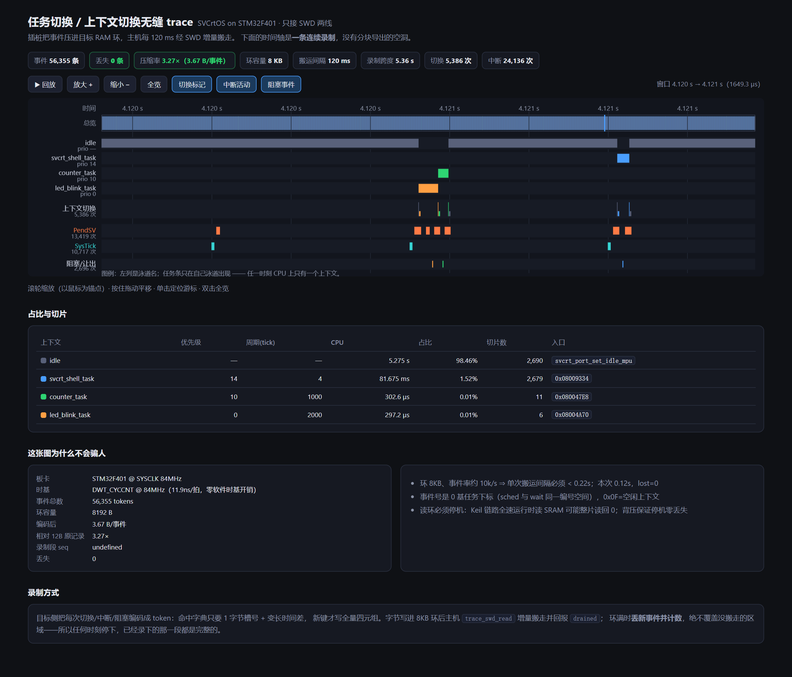

# Mdkdebug —— 可被 AI 工具调用的 Keil uVision 调试服务

> **你只要把线接好，剩下的交给 AI。**

通过 **UVSOCK/TCP** 协议连接 Keil uVision 调试器，以 **MCP（Model Context Protocol）Server**
形式，向 Claude、灵犀等 AI 工具暴露嵌入式在线调试能力：读变量 / 表达式、读写目标内存、
运行控制（运行 / 暂停 / 复位 / 单步）、断点管理，以及自动进入 / 退出调试模式。

适用于 Cortex-M 等 ARM 目标板的在线调试。协议层参考自
[KeilAssistant](https://gitee.com/keyoushide/keil-assistant) 的 UVSOCK 实现。

---

## 先看一个真板实测的结果



上面这张图不是示意图，是 **STM32F401 上真跑一个 RTOS 的实测回放**：5.36 s 连续录制、
**56,355 条事件、5,386 次上下文切换、24,136 次中断进出、0 条丢失**，编码后只有
**3.67 字节/事件（相对 12 字节记录 3.27× 压缩）**，时间戳取目标侧 `DWT_CYCCNT`（11.9 ns/拍），
所以微秒级的切片也分辨得出来。

**它怎么做到「只接 SWD 两线还能连续不丢」**——两件事：

1. **目标侧先压缩**。每次切换 / 中断 / 阻塞编成 token：命中字典只写 1 字节槽号 + 变长时间差，
   新键才写全量四元组 `(type, kind, id, arg)`；槽号是四元组的直接映射哈希。
2. **背压而不是覆盖**。字节写进 8 KB RAM 环，主机用 `trace_swd_read` 增量搬走并回报
   `drained`；环满时**丢新事件并计数（`lost_events`）**，绝不覆盖没搬走的区域。
   于是任何时刻停下，**已经录下的那一段都是完整的**；只要平均搬运速度跟得上，就一条都不丢。

```
trace_instrument(backend="swd", swd_bytes=8192)
  → trace_swd_status(...)    # 环容量 / 未读字节 / lost / 压缩比
  → trace_swd_next(...)      # 还能录多久 / 该多久搬一次（算出来的节拍，不用试）
  → trace_swd_read(..., out_file="trace.json")   # 搬走未读的那一段并解成事件
  → （循环：跑一段 → 搬一段；停机搬走不会丢任何东西）
```

前提说清楚：这条路要先**插桩**（编译期改代码），事件率约 10k/s 时 8 KB 环只够 0.22 s，
**搬运间隔必须短于这个窗口**；也别指望它替代 SWO/ETM——它解决的是「板子只焊了 SWD 两线」
这个场景。SWO/RTT/ETM 怎么选，见 `trace_guide`。

可交互版本（滚轮缩放 / 拖动平移 / 单击定位 / 回放，含任务泳道、上下文切换带、
PendSV/SysTick 中断活动与阻塞事件通道）：
[`docs/demo/trace-replay-swd.html`](docs/demo/trace-replay-swd.html)。
*gitee 只能预览 HTML 源码*，把仓库 clone 下来双击这个文件（无需服务器、无外部依赖）
就能看到上面截图里的交互页面。
页面刻意把「单核、同一时刻只有一个任务在跑」画在脸上：每个任务的运行条**同一像素列里只会亮一条**，
不把单核画成并行的泳道。详见 [docs/demo/README.md](docs/demo/README.md)。

<!-- 早先用「全速跑 + 事后一次性搬走 24 KB 缓冲」录的那一版留在这里做对照：
     trace-replay-singlecore.html（分块导出、块间有空洞、会丢旧记录） -->

---

## 功能特性

## 功能特性

- **MCP Server**：以标准 `stdio` 或 `streamable HTTP` 传输方式暴露调试能力，AI 工具可直接调用；
- **表达式 / 变量读取**：`calc_expression` 读全局变量、寄存器、指针解引用（如 `SData_UA`、`*(uint32_t*)0x20000000`）；
- **内存读写**：任意地址读 / 写，超过单次上限（16 KB）自动分块，规避 Keil 协议长度限制；
- **运行控制**：全速运行、暂停、复位、单步（`into` / `over` / `out` / `instruction`）、`run_to_line` 运行到指定行；单步/运行到行后**自动附带当前停靠位置（`文件:行号`）+ 源码上下文 + 调用栈**，让 AI 单步进函数 / 出函数后立即看到效果，不必再额外查询；
- **像人一样看代码位置**：`get_current_location` 读取当前 PC，基于 `.axf` 调试符号定位到 `源文件:行号`，返回该行附近源码上下文与**完整调用栈回溯**（PC/LR/SP + 栈启发式扫描，多级调用链），让 AI 像人一样知道程序停在哪、是谁调进来的；并检测源码是否比 `.axf` 新（漂移时提示先重编译）；
- **局部变量读取**：`read_locals` 基于 DWARF 解析当前 PC 所在函数的参数与局部变量，用 `calc_expression` 在当前上下文求值，让 AI 看到当前函数的局部状态（而非仅全局变量）；
- **断点命中与定时运行**：程序停在 `set_breakpoint` 所设断点时返回命中反馈（含命中次数）；`run_timeout` 全速运行 N 毫秒后自动暂停并返回停靠位置，便于验证时序；
- **断点带位置**：`set_breakpoint` 自动反查断点对应的 `文件:行号`，`list_breakpoints` 返回断点列表含位置信息；
- **断点管理**：设 / 删 / 列断点，基于 Keil 命令窗口命令（`BS` / `BK` / `BL`）；断点列表解析自窗口 `BL` 的**真实输出**（含代码断点与数据观察点、Keil 断点编号、命中计数），清除时优先**按 Keil 断点编号**执行（数据观察点按地址会报 `error 72` 清不掉），并提供 `hard=true` 一键清空 Keil 侧全部断点；
- **数据断点（watchpoint）**：`set_watchpoint` 在变量 / 地址处设 读 / 写 / 读写 访问断点（Keil `BS READ/WRITE/READWRITE`），命中即暂停，用于观察某内存被访问的时机；
- **状态快照**：`snapshot` 一次性返回当前位置（文件行 + PC）+ 源码上下文 + 完整调用栈 + 局部变量 + 指定全局变量，让 AI 一眼看清程序卡在哪、处于什么状态；
- **变量组**：`watch` 批量读取一组表达式的当前值，便于固定观察多路信号；
- **结构体字段概览**：`read_struct` 基于 DWARF 解析结构体的字段布局（类型 / 偏移 / 大小），并用基址 + 偏移读取各字段运行时值，让 AI 看清一个结构体的完整内容；
- **寄存器组 + AAPCS**：`read_registers` 批量读取 R0-R12/SP/LR/PC/xPSR 并解读 AAPCS 调用约定（R0-R3 入参、R0 返回值、LR 返回地址），排查函数参数传错 / 返回值不对 / 寄存器被踩；
- **反汇编**：`disassemble` 用 capstone 反汇编目标代码（支持 `0x地址` / 符号名 / 文件:行 / 缺省 PC），排查死循环、跑飞、启动流程与优化后行为；
- **内存分析套件**：内存地图（`query_memory_map`）+ 字节搜索（`search_mem`）+ 批量填充（`fill_mem`）+ 外设写（`write_peripheral`）+ 状态 diff（`snapshot_diff`）+ 函数耗时（`profile_function`）+ 异常自动抓取（`wait_fault`），覆盖从定位地址、找魔数到观察运行变化、复现崩溃的全链路；
- **工程产物解析**：`parse_build_errors` 把编译错误/警告解析为结构化列表（兼容 AC5/AC6 两种格式），`parse_map` 解析 .map 的 FLASH/RAM 占用、符号地址与栈使用；
- **批量命令**：`read_mem_multi` 一次读取多个地址内存、`batch` 一次提交多条只读命令（read_mem/read_variable/calc_expression/get_status/read_registers）聚合返回，显著减少 AI 往返；
- **多 target / 工程配置**：`project_targets` 枚举工程全部 target + 当前 target + 调试 target，`set_debug_target` 切换调试目标，`read_project_config` 解析各 target 的编译器（AC5/AC6）、优化级别（-O0~-Otime）、编译宏 Define 与包含路径——排查“不同 target 行为不同”时对比宏/优化差异；
- **采样剖析**：`profile_sampling` 基于 PC 统计采样定位热点函数（按 .axf 符号表归函数算占比），找“哪个函数占 CPU 最多”的性能瓶颈；`profile_function`/`dwt` 做函数级精确计时；
- **目标器件信息**：`target_info` 实时读 DBGMCU->IDCODE 判芯片 DEV_ID/REV_ID + SCB->CPUID 判内核类型，返回标称 Flash/RAM 容量与内存布局，排查资源吃紧/选错型号/容量不符；
- **环境自检 + 工作流引导**：`mdk_guide` 一键自检 Keil/UVSOCK/UV4/.axf/源码漂移/调试态/RTOS 类型，并返回推荐调试工作流与各场景应调用的工具——AI 落地的第一个工具，避免盲目试错；
- **一键诊断**：`diagnose` 聚合寄存器组 + PC 反汇编 + 源码上下文 + 调用栈 + 局部变量 + 指定全局变量，AI 接到 bug 报告后一次调用即可看清现场；
- **符号检索**：`find_symbol` 从 .axf ELF 符号表模糊检索函数/全局变量（地址+类型），AI 读任意符号不再靠猜名字；
- **写寄存器 / 改 PC**：`set_register` 写 CPU 寄存器并读回验证，可修正现场、改返回值、改 PC 跳转执行；
- **性能分析**：`dwt` 读 DWT 周期计数器（自动使能），配合两次采样测代码段执行时间；
- **HardFault / 异常定位**：`fault_report` 读 SCB 寄存器判异常类型与原因，并从异常栈帧恢复现场（PC/LR/R0-R3），排查死机/跑飞；
- **复位循环识别**：`watch_reset` 按固定间隔读 `DHCSR.S_RESET_ST`（读即清），把「启动即死 / 喂狗超时 / 反复复位」这类没有单次停靠可抓的故障识别出来——间隔稳定即判复位循环，快过采样间隔时如实说「测不出周期」而不是编一个；由于该位读即清、且 Keil 在目标复位后会重新同步并自读一次 DHCSR，单靠它**会漏报**，所以还可传 `flags_addr` 指定芯片的复位标志寄存器（如 STM32 的 `RCC_CSR=0x40023874`）做交叉验证：窗口前后各读一次，报出被置起的位置，位含义照手册读、本工具不解释；
- **条件断点**：`set_conditional_breakpoint` 设 C 表达式条件/命中次数断点，只在特定条件或第 N 次命中才停；
- **外设寄存器一键读（SFR）**：`read_peripheral` 内置 STM32F4 常用外设寄存器表（RCC/GPIO/USART/SPI/I2C/TIM/ADC/PWR/FLASH/SysTick/SCB/NVIC/DWT/EXTI/SYSCFG），一键读指定外设全部寄存器当前值并解析关键位域（时钟使能/波特率/GPIO 模式/定时器计数），`list_peripherals` 列出可用外设——排查时钟没使能、GPIO 模式配置错、串口波特率不对等场景，**不依赖外部 SVD 文件、离线可用**；
- **ITM / Debug(printf) Viewer trace**：`itm_trace` 检查 Trace 配置（DEMCR.TRCENA / ITM->TCR / ITM->TER）是否就绪，并经 UVSOCK 串口通道拉取 Debug(printf) Viewer 收到的 ITM 打印文本，再交给 `traceproto` 做**结构化解码**——按 ITM 报文给出 port / header / `data_text`，`overflow` 与半包（`leftover_bytes`）如实计数，连续拉取只喂新增字节，不把丢过包的时间线当完整证据；printf 走 SWO 输出时无需占用 UART，排查实时日志/运行状态；真实 ITM 输出需 Keil 已配置 Trace（Core Clock + Stimulus Port0）且调试器（ST-Link/J-Link）SWO 引脚已连接；
- **自动进出调试模式**：`enter_debug` / `exit_debug`，支持 AI 驱动"进入 → 设断点 → 运行到断点 → 读变量 → 退出"完整闭环；
- **编译 / 烧录闭环**：基于 Keil 官方 `UV4.exe` 命令行，提供 `build_project`（编译）、`rebuild_project`（重编译）、`flash_download`（烧录）、`build_and_flash`（编译成功后自动烧录），支持 AI 自主"改代码 → 编译 → 烧录 → 上板"全流程闭环；
- **后台静默编译**：编译 / 烧录以隐藏窗口方式启动 UV4，**不会闪现新的 Keil 界面**，用户已打开的实例不受打扰；
- **AI 管理 Keil 开关（闭环）**：`launch_uvision` 拉起 Keil 打开工程（已有同工程窗口则复用，不新开），`close_uvision` 关闭 Keil（默认优雅关闭、残留自动强制），Keil 的开启/关闭全部由 AI 闭环管理，无需手动操作；
- **Keil 窗口不累积**：UV4.exe **不是**单实例程序（真机实测同工程可并存 6 个窗口），因此 `launch_uvision`、编译后调试通道自愈都先查已有实例、复用而不新开；默认 `single=true` 时**已经开着别的工程就拒绝新开**（`keil-multiple-instances`，摆出既有实例与下一步），同工程则强制复用（`reuse_forced`）——确需多窗口才传 `single=false`。`list_uvision_instances` 可随时清点，`close_uvision(keep="oldest")` 把多余的收敛成一个（**持 UVSOCK 4823 的是最早那个实例**），保证「只开一个窗口调试」；
- **先改文件、后开 Keil**：「先开 Keil 再改源码/工程」会让 Keil 弹「文件已被外部修改」的**模态框**，并把 UVSOCK 通道一起堵死（表现成「调试通道假死」）。因此 `launch_uvision` 成功即返回 `order_hint`，`uvprojx_edit` 在 Keil 开着同一工程时直接拒绝（`project-open-in-keil`，`force=true` 才放行）；
- **规避旧窗口调试旧代码**：`flash_debug` 自动按「关闭所有 Keil → 让新固件上板 → 重新打开本工程 → 进入调试」顺序执行，避免因残留旧工程窗口导致调试到旧代码（即使 AI 不记得先关旧窗口也能保证加载的是新固件符号）；上板方式**自动选路**：工程勾选了 Keil 的 `Update Target before Debugging`（`.uvprojx` 的 `UpdateFlashBeforeDebugging=1`，Keil 默认）时，进入调试会由 Keil 自己把最新程序下载进 Flash，于是只编译、不再显式烧录（省掉一次全片擦写与 `UV4 -f` 往返），返回 `flash_plan=debug_download`；未勾选时才退回显式烧录（`flash_plan=explicit_flash`）；
- **编译烧录输出集中返回**：每次编译/烧录的完整日志（含警告/错误）经 `-o` 捕获并由 AI 完整返回，在对话中即可查看，无需盯 Keil 窗口；
- **UV4 自动探测**：优先显式 `--uv4-path`，其次**枚举本机全部盘符** × 常见安装子目录，最后查 Windows 注册表——**32 / 64 两个视图都查**（Keil 是 32 位程序，只读默认视图在 64 位系统上会一无所获），`Path` 值兼容「安装根」与「工具根」两种写法；
- **连接缓存**：常驻服务内共享一条 TCP 连接，空闲自动断开、下次调用自动重连；
- **并发调用可安全并行**：所有 UVSOCK 命令经**统一闸门串行化**——进程内 RLock（同进程多线程）+ 跨进程锁文件（多个 mdkdebug 实例共用同一调试通道时也只允许一个发命令），超时降级并如实记入遥测；`get_status` / `keil_health` 会回报**其他 mdkdebug 实例**（PID + 心跳年龄）并在有竞争时给出 `concurrency_warning`，把「写入被静默吞掉」从猜测变成可见证据；详见 [docs/PITFALLS.md](./docs/PITFALLS.md)；
- **第二条调试通道：Keil 官方命令行批处理（`UV4 -d`）**：`batch_debug_script` 把一串命令写成初始化文件挂到 `.uvoptx` 的 `<tIfile>`，以 `-j0` 无人值守执行，按日志逐条判定执行结果。**为什么要它**：不依赖 UVSOCK 交互式会话，进程隔离、天然可重放，适合「跑一段固定脚本 → 拿结果」的冒烟/回归；UVSOCK 不可用时也是降级通道。已处理三个真机硬坑：初始化文件与 trace 落到 ASCII 临时目录、`.uvoptx` 前置备份 + finally **字节级**还原、`<tIfile>` 唯一性先数再换；静态 lint 会拦下真机会挂死的写法（`Go main` / `DISPLAY` / `SAVE` / `Step`）并给正确写法；
- **Modbus 主站（规范 RTU/ASCII + 非规范裸帧）**：`modbus_read` / `modbus_write` / `modbus_scan` / `modbus_sniff` / `modbus_raw` / `modbus_decode` / `modbus_session`。**为什么不能用串口日志监听做**：`serialmon` 是**按行**切分的日志通道，而 Modbus 是二进制帧（含 `\x00`、没有换行、多从站应答会连成一坨），按行切必然切坏——所以 Modbus 走**独立的二进制收发路径**，按**帧间静默 t3.5**（>19200 波特固定 1.75ms）切帧。协议侧：CRC16 / LRC 自己算、功能码 01/02/03/04/05/06/0F/10、异常帧译中文（`0x02` → 地址越界）、规范上限（读寄存器 ≤125 / 读线圈 ≤2000 / 写寄存器 ≤123）**在发出去之前就拦**。**关键取舍：字节回来了 ≠ 帧是对的**——`transact` 的 `ok` 只表示「有没有字节返回」，另给 `parsed_ok`；半帧 / CRC 不过时 `modbus_read` 判**失败**，且与「一个字节都没收到」分开报（`modbus-bad-crc` vs `modbus-timeout-no-response`，这两类问题的排查方向完全不同），而 `modbus_raw` 保持传输层口径——它存在的意义就是看非规范帧。端口是独占资源：串口日志监听正占着同口时**明确报错、不抢口**（抢来的「成功」会收到错数据）；同口同参数**复用不重开**，避免 DTR 抖动把目标板复位；帧方向**自动识别**——旁听/抓包得到的帧多半是主站请求，先按应答解、不符再按请求解，`05`/`06`/`08`/`16` 这类请求与应答同形的功能码如实标 `ambiguous`，**不把最常见的读请求一律判成「载荷不符」**。
- **报错知识库**：`explain_build_error` + `keil_command` 把编译诊断文本与 Keil 命令错误码翻成「含义 / 根因 / 修法」（`#20 identifier is undefined`、`error 57 illegal address`、`error 145` 断点已存在…）。**只收录真机实测过的条目**，未收录的一律 `confidence=unknown` + 通用排查路径，不编造含义；
- **CMSIS-SVD 解码**：`svd_list` / `svd_decode` 按芯片厂商的 SVD 解释寄存器值（比内置硬编码表更权威、换型号也能用）：支持 `derivedFrom` 继承、`cluster`、数组与枚举位域；**地址反查**按 `<addressBlock>` 界定真实范围（固定窗口会在外设密集排布处串台），结果附 `matched_by` 标可信度、附 `svd_device` 标明用的是哪份 SVD；不给器件时按当前工程 `<Device>` 推断，**绝不盲挑盘上第一份 .svd**；
- **工程文件受控编辑**：`uvprojx_read` / `uvprojx_edit` 只读查看与增删包含路径/文件；改前默认备份、文本级替换不重排工程、锚点唯一性校验后再写，空改动不落盘（不写坏用户工程）；
- **通用等待与能力自述**：`wait_state` 一次完成「等待 + 超时 + 现场」（`timeout` / `unreachable` / `never_debugging` 三种超时分开报）；`capabilities` 一次问清当前环境两条通道、内置模块与工具面；`address_for_line` 补齐「源码行 → 地址」反查（返回偶数地址，避开 Keil 的 `error 57`）；
- **跨会话状态（`session_state`）**：把「上次调到哪」存成文件——工程 / 符号文件 / UV4 路径 / 串口 /
  调试态 / 断点 / 数据断点 / SVD 器件 / 工具集 / 快照基线一键 `save` 到 `state.json`（默认 `~/.mdkdebug/state.json`，
  可用 `path` 或 `MDKDEBUG_STATE_FILE` 指定，多工程各存一份）；`load` 默认**只对比不应用**，
  `apply=true` 也只做**主机侧可逆动作**（切换符号文件），断点 / 内存 / 运行态一律标 `never_auto_applied`
  ——恢复现场交给人/AI 决定，工具不替调用方猜。原子写 + 旧版 `.bak`，文件损坏 / 结构不符 / `schema` 不符
  都明确报错，不假装「没有状态」；
- **高输出工具的输出控制三件套（`compact` / `max_lines` / `full`）**：`list_tools`、`snapshot`、
  `read_registers`、`parse_map`、`serial_read` 等 36 个「列表 + 长说明」型工具的返回体容易吃掉上下文预算。
  受控工具额外接受三个**可选**参数：`max_lines=N` 只留 N 条、`compact=true` 去空值字段 + 把元素间完全相同的
  字段提到 `output.shared` + 把说明类长文本截断到 200 字符、`full=true` 取全量（覆盖环境变量默认与 `max_lines`）。
  **不传参数时行为与以前一字不差**；**裁了就报**（`output.truncated` / `dropped` / `hint`），
  **不碰真值**（数值与 line/text/value/data 这类内容字段绝不截断，列表元素不改写）；
- **随附 companion 技能 `skills/mdkdebug/SKILL.md`**：把「怎么用这套工具」写成 AI 可直接读的技能文件
  （先自检再动手、四条主线工作流、`session_state` 接续、三个输出控制旋钮、参数与工具面约定、出错先看谁），
  避免每次冷启动都从 `list_tools` 摸索；
- **不依赖 Keil 的芯片也能调**：`toolchain_*` 自己探测 gcc/make/cmake 并跑构建、`target_*` 把接口与 trace 参数固化成 20 份档案、`ocd_*` 用 OpenOCD 做内存/寄存器/断点/烧录——RISC-V、ESP32 这类不用 MDK 的目标走这条链路，与 Keil 链路互不干扰；
- **SWD/SWO 两条 trace 通路 + 目标侧插桩**：`trace_swo_*` 走 TPIU/ITM 单线输出，`trace_rtt_*` 主机侧自研读写 SEGGER 兼容环形缓冲（不依赖上位机），另有 SWD 采样剖析（明标侵入式）与 DWT 计数器。**插桩分两种工作模式**：`stream` 持续录持续读（要人在旁边盯着看），`buff` **全速录、事后搬**——固件自己往静态环形缓冲写，调试器只在 dump 那一下进来，时间粒度由目标侧 DWT 决定（可到 10 ns 级），**录制期间目标不停、不 halt、不占 SWO/ETM**；配套 `trace_buff_status` / `trace_buff_dump` / `trace_buff_reset`。**观测类工具（RTT / 变量 scope / halt 采样 / DWT / PC 采样）在 Keil 与 OpenOCD 两条链路上通用**，用 `link=auto|keil|ocd` 选路：
    - `auto` 哪条链路有活会话用哪条（两条都有时优先 Keil）；
    - 显式指定而那条不可用时**不拿另一条顶上**（那会读到另一个目标的现场），直接报错并带上两条链路各自的原因与起法；
    - 读到的东西一定带 `read_confidence` / `while_running` / `degenerate`——**读到的 0 不等于数据是 0**；主机侧只能看到“目标愿意发出来的东西”，所以配套提供目标侧插桩组件 `components/trace/`（ITM/RTT/UART/**目标侧缓冲** 四后端，只依赖 CMSIS），事件按带 CRC8 的 MTF 帧传出，丢包与坏帧**如实计数上报**；
- **随附模拟调试器**：无需硬件即可离线联调与跑测试（UVSOCK 与 OpenOCD 各一份）。

## 工作原理

### 架构

```
┌──────────────┐  MCP(stdio/http)  ┌──────────────────┐  UVSOCK/TCP  ┌─────────────────┐
│  AI 工具客户端 │ ────────────────► │  Mdkdebug MCP Server │ ─────────────► │  Keil uVision   │
│ (Claude/灵犀) │                  │     (mdkdebug)     │  127.0.0.1:4823 │  + UVSOCK 插件  │
└──────────────┘                  └──────────────────┘               └─────────────────┘
```

AI 客户端通过 MCP 协议把用户/模型意图转成工具调用；`mdkdebug` 收到后，按 **UVSOCK** 二进制
协议把请求编码成命令帧，通过 TCP 发送给 Keil uVision 中加载的 UVSOCK 调试插件执行，并回传结果。

### UVSOCK 协议要点

- 默认监听 `127.0.0.1:4823`；
- 命令帧：头部 32 字节（`m_nTotalLen` / `m_eCmd` / `m_nBufLen` / `cycles` / `tStamp` / `m_Id`）+ 数据段；
  响应帧头部在此基础上多 8 字节（`r_cmd` / `r_status`），地址小端；
- 关键命令码：

| 命令 | 码值 | 说明 |
|------|------|------|
| `UV_DBG_ENTER` | `0x2000` | 进入调试模式 |
| `UV_DBG_EXIT` | `0x2001` | 退出调试模式 |
| `UV_DBG_START_EXECUTION` | `0x2002` | 全速运行 |
| `UV_DBG_STOP_EXECUTION` | `0x2003` | 暂停 |
| `UV_DBG_STATUS` | `0x2004` | 查询调试/目标状态 |
| `UV_DBG_RESET` | `0x2005` | 复位 |
| `UV_DBG_STEP_INTO` | `0x2007` | 单步进入 |
| `UV_DBG_CALC_EXPRESSION` | `0x200A` | 计算表达式 / 读变量 |
| `UV_DBG_MEM_READ` | `0x200B` | 读内存 |
| `UV_DBG_MEM_WRITE` | `0x200C` | 写内存 |
| `UV_DBG_EXEC_CMD` | `0x2020` | 执行命令窗口命令（`BS`/`BK`/`BL`/`EVAL`） |

> `UV_DBG_STATUS` 的响应码语义为 **`0`=已停止、`1`=执行中**（区别于通用 `UV_STATUS` 错误码）。

## 环境与依赖

### 环境要求

| 项 | 要求 |
|----|------|
| 操作系统 | Windows（Keil uVision 运行环境） |
| Python | ≥ 3.11（开发 / 验证于 3.12） |
| Keil | uVision 5，且已配置 UVSOCK 调试插件（见"对接真实 Keil"） |
| Keil UV4 | `UV4.exe` 用于编译 / 烧录，可自动探测或 `--uv4-path` 指定（通常随 Keil 安装于 `UV4/UV4.exe`） |
| OpenOCD（可选） | 调非 MDK 芯片 / 用 trace 时需要：可自动探测，也可在 `ocd_start(exe=...)` 指定；不需要时 `ocd` / `trace` 两组可收起（见[工具面](#工具面默认精简--按需装载)） |
| 交叉工具链（可选） | `toolchain_*` 系列会自动扫描常见安装位置；本机没有的家族列在 `missing` 里，不报错 |

> **MDK 与非 MDK 两条链路互相独立**：只调 Keil 工程时不需要 OpenOCD，只调 RISC-V / ESP32 时不需要装 Keil。

### Python 组件依赖

见 `requirements.txt`，核心依赖：

| 包 | 版本 | 作用 |
|----|------|------|
| `mcp` | ≥ 2.0（验证于 2.2.0） | MCP Server 框架（`MCPServer`） |
| `pydantic` | ≥ 2.8（验证于 2.13.5） | MCP 依赖的类型模型 |
| `pyelftools` | ≥ 0.30（验证于 0.33） | 解析 `.axf` 调试符号，供 `get_current_location` / `run_to_line` / 断点位置定位使用 |
| `capstone` | ≥ 5.0（验证于 5.0.9） | Thumb 反汇编，供 `disassemble` / `diagnose` 使用 |

安装（两种方式任选其一）：

```bash
# 方式一：仅装依赖，从源码运行
pip install -r requirements.txt
python run_server.py

# 方式二：打包安装（推荐，可执行 mdkdebug 命令）
pip install -e .
mdkdebug --version
```

> 注：`mcp 2.x` 中 `FastMCP` 已改名为 `MCPServer`（`from mcp.server.mcpserver import MCPServer`），
> 工具通过 `@server.tool()` + 类型注解注册。

## 目录结构

```
mdk_agent/
├── run_server.py             # 启动入口薄壳（转发到 mdkdebug.cli）
├── pyproject.toml            # 打包配置（pip install -e .）
├── requirements.txt          # Python 依赖
├── README.md
├── mdkdebug/
│   ├── __init__.py           # 包初始化（版本号 0.1.8）
│   ├── cli.py                # 命令行入口（main，mdkdebug 命令）
│   ├── uvsock.py             # UVSOCK 协议：命令码、VSET/AMEM/EXECCMD 打包与解析
│   ├── interface.py          # TCP 物理接口层（含异步消息残留清理）
│   ├── client.py             # UVClient：调试能力封装 + 连接缓存
│   ├── builder.py            # UV4 命令行：编译 / 重编译 / 烧录 / 编译烧录闭环
│   ├── locator.py            # 基于 .axf DWARF 的符号定位（地址↔文件:行 双向 + 源码读取）
│   ├── periph.py             # 内置 STM32F4 常用外设寄存器表（RCC/GPIO/USART/SPI/I2C/TIM/...）+ 内存区域地图
│   ├── mapfile.py            # .map 链接映射文件解析（Program Size/sections/symbols/栈使用/未用段）
│   ├── outctl.py             # 高输出工具的输出控制（compact / max_lines / full）
│   ├── session.py            # 跨会话状态存储（state.json：原子写 + 旧版备份 + diff）
│   ├── toolchain.py          # 非 MDK：gcc/make/cmake 探测、构建、ELF/size/objcopy、编译错误解析
│   ├── targets.py            # 非 MDK：目标档案（接口/速度/SWO/RTT 参数）与按名称、ELF 自动识别
│   ├── ocd.py                # 非 MDK：OpenOCD telnet 会话与内存/寄存器/断点/烧录操作
│   ├── linkio.py             # 链路原语层：把「读/写内存、读核寄存器、停/走」从 Keil(UVSOCK) 与 OpenOCD 里抽出来
│   ├── traceproto.py         # trace 协议：ITM 解码、MTF 帧格式与 CRC8
│   ├── trace.py              # trace：SWO / RTT（主机侧自研）/ SWD 采样 / DWT / 插桩组件部署（观测类工具两条链路通用）
│   └── server.py             # MCP Server 与 195 个工具定义
├── components/
│   └── trace/                # 目标侧插桩组件（ITM / RTT / UART / BUFF 四后端，只依赖 CMSIS）
│                             #   mdk_trace.[ch] / mdk_trace_rtt.[ch] / config 默认头 / CMakeLists / README
├── skills/
│   └── mdkdebug/SKILL.md     # 随附 companion 技能（工作流 / 参数约定 / 输出控制 / 排障入口）
├── tools/
│   └── run_all_tests.py      # 统一测试闸门（工具数一致性检查 + 逐批回归）
├── tests/
│   ├── mock_uvsock_server.py # 模拟 Keil 调试器的 UVSOCK 服务器（离线联调）
│   ├── mock_openocd.py       # 模拟 OpenOCD 的 telnet 服务器（含假 RAM / RTT 控制块，离线联调）
│   ├── test_batch*.py        # 各批次 mock 回归（批次 8 拆为 8a/8b/8cd；逐批覆盖该批新增工具）
│   └── test_e2e / test_mcp / test_stdio / test_enhanced / test_unhardcode / test_diag.py
│                             # 协议闭环 / MCP 工具注册 / stdio 握手 / 增强功能 / 去硬编码 / 诊断
├── example_mdk_project/      # 随附 STM32F4 HAL 例程（MDK/UVSOCK 链路的真机验证目标）
└── example_gcc_project/      # 随附 GCC 例程（非 MDK 链路的真机验证目标）
    └── rtt_probe/            # STM32F401 自建 RTT 验证固件（引用 components/trace，无需 Keil）
```

## 快速开始

### 启动 MCP Server

**方式一：stdio（MCP 客户端标准方式）**

```bash
python run_server.py                              # 默认连 127.0.0.1:4823
python run_server.py --port 4823 --idle-timeout 30
```

**方式二：Streamable HTTP（便于远程 / 网页 MCP 客户端）**

```bash
python run_server.py --transport http --http-port 8300
```

参数说明：

| 参数 | 默认 | 说明 |
|------|------|------|
| `--host` / `--port` | `127.0.0.1` / `4823` | Keil **UVSOCK 插件**监听的地址 |
| `--idle-timeout` | `30.0` | 连接缓存空闲断开秒数（`0` 表示不主动断开） |
| `--transport` | `stdio` | `stdio` 或 `http` |
| `--http-host` / `--http-port` | `127.0.0.1` / `8300` | HTTP 传输时的监听地址 |
| `--uv4-path` | 自动探测 | Keil `UV4.exe` 绝对路径，缺省时自动探测（如 `D:/Keil_v5/UV4/UV4.exe`） |
| `--default-project` | 无 | 默认待编译 / 烧录的 `.uvprojx` 工程路径，工具调用可省略 `project` 参数 |

## 暴露的 MCP 工具

共 **195** 个（**默认只暴露 44 个**，其余按需装载，见[工具面](#工具面默认精简--按需装载)），分两大块：

- **MDK 族（110 个）**——调试读写 / 断点与命中等待 / 外设与内存 / 符号定位 / 工程分析 / **编译·清理·烧录** / **UV4 命令行批处理调试** / **CMSIS-SVD 解码** / **工程文件与分散加载文件(.sct)受控编辑** / **复位循环识别** / Keil 生命周期管理 / **宿主机串口日志与命令应答 · Modbus 主站（RTU/ASCII + 裸帧）** / **看门狗冻结与 Cache 感知** / 环境自检引导（下表）。
- **非 MDK 族（68 个）**——**工具链**（gcc/make/cmake 探测与调用、构建、ELF/size/objcopy、编译错误解析，10 个）/ **目标档案与多核**（接口·速度·SWO·RTT 参数档案与自动识别、工程现场配置发现、多核目标的核列举与切换，7 个）/ **OpenOCD**（会话·内存·寄存器·断点·烧录，17 个）/ **trace 与覆盖率**（SWO·RTT·采样剖析·DWT·非侵入式 scope·插桩组件部署·**代码覆盖率**·**ETM 能力探测**·**函数运行时线录制**·**目标侧缓冲后端**·**SWD 无缝流后端**、**任务表取名**，34 个）——不依赖 Keil，同样能在 RISC-V / ESP32 等非 MDK 芯片上工作（见[非 MDK 芯片与 trace](#非-mdk-芯片与-trace不依赖-keil)）。
- **常驻元工具（6 个）**——`toolset`（工具面按需装载）/ `list_tools` / `capabilities` / `get_version` / `tools_groups` / `tools_load`：**永不被裁**，否则 AI 连工具清单都问不出来、也装不回来。
- **RTOS 任务感知（3 个）**——`rtos_info` / `rtos_tasks` / `rtos_objects`：FreeRTOS 的任务列表、状态、**栈水位**与队列/信号量。**跨两条链路**（有 Keil 会话走 UVSOCK，否则走 OpenOCD），因为「多任务卡死」既发生在 MDK 工程里也发生在 gcc 工程里（见 [RTOS 任务感知](#rtos-任务感知rtos_3-个)）。

下表为 MDK 族工具：

| 工具 | 说明 | 主要参数 |
|------|------|----------|
| `get_version` | 查询 UVSOCK 插件版本 | — |
| `get_status` | 查询是否处于调试、目标是否运行、状态码，并附**当前符号文件路径 + 时间戳**（`symbol_file`/`symbol_mtime_text`）、**符号陈旧判定**（`symbol_stale` + `symbol_stale_warning`：编译/烧录后旧会话符号过期，求值会报 status 13）、**串行化与并发视图**（`serialization`，含其他 mdkdebug 实例清点） | — |
| `calc_expression` | 计算并读取表达式 / 变量值 | `expr` |
| `read_variable` | 按变量名查地址/值/大小，支持数组逐元素与整块内存；App 侧重定位场景可配 `reloc_delta` 自动换算运行地址 | `name`、`count?`、`reloc_delta?` |
| `read_mem` | 读取目标内存（`n_bytes` 可写作别名 `length`；`reloc_delta` 用于 App 侧重定位后按运行地址读）。**脏读防护**（`verify`，默认 `auto`）：stop 后紧跟的首次读可能整帧返 0（真机实测 0x08022000 读出 16 个 `00`，重读即正确）——`auto` 在「首帧整帧退化（全 `0x00`/全 `0xFF`）或距最近一次 stop 不足 1 秒」时自动复读、**连续两次一致才采纳**，并返回 `read_confidence`/`reread_count`/`reread_consistent`/`degenerate`/`since_stop_s`；首帧是脏值时用 `first_read_hex` 留证。`verify=true` 强制确认、`false` 关闭（**布尔/字符串都收**，`verify=false` 与 `"false"` 等价）；Flash 区稳定读出全 `0xFF` 判为**已擦除的预期内容**（`content_note`，不降置信度）。**D-Cache 感知**：读 SRAM 且目标 D-Cache 已使能时附 `cache` 字段，提醒「DAP 直读可能拿到内存旧值（CPU 新值还在脏行里）」。**运行态读写**（`running`，默认 `live`）：目标全速跑时读内存**实测可行**，不再要求先停——`live` 直接读并附 `while_running`（读取期间目标是否在跑）；`running="halt"` 做**停-读-走**快照（自动 stop → 读 → run，返回 `sampling`/`was_running`/`paused_ms`/`resumed`/`halt_note`，恢复失败会告警），会打断目标、有副作用，须显式要求 | `addr`（`0x…` 或十进制）、`n_bytes`、`reloc_delta?`、`verify?`（默认 `auto`，可传布尔）、`running?`（`live`/`halt`，默认 `live`） |
| `write_mem` | 写入目标内存，**默认写后回读校验**（`verify=true` → `verified`/`readback_hex`）：写入被静默忽略（目标运行中/只读区/另一实例并发写）时给出 `verified=false` 与原因，不再「看着成功其实没写进去」。**D-Cache 感知**：写 SRAM 且目标 D-Cache 已使能时附 `cache` 字段，提醒「写下的值可能稍后被脏行回写覆盖（写入仍报成功）」。**运行态写入**（`running`，默认 `live`）：`running="halt"` 用停-写-校验-走，避免写下的值立刻被 CPU 覆盖（同样返回 `paused_ms`/`resumed`/`halt_note`） | `addr`、`data_hex`（十六进制串，可带空格）、`verify?`（默认 true）、`running?`（`live`/`halt`，默认 `live`） |
| `cache_info` | 读 `SCB->CCR` 判定目标是否使能 D-Cache / I-Cache（并粗略解析 CCSIDR 得到行/路/组与容量）。**为什么重要**：D-Cache 开着时 DAP **直读 RAM 可能是陈旧值**、**直写 RAM 可能被脏行回写覆盖**，两者都不报错——`read_mem`/`write_mem` 命中 SRAM 时也会附 `cache` 字段提示（探测结果 5 秒 TTL 缓存，不额外拖慢读写）；M3/M4 无 D-Cache、M7 默认不开，此时不产生任何噪声字段 | — |
| `dcache_maintain` | **D-Cache 一致性维护**（M7 等带 D-Cache 的核）：`read_mem`/`write_mem` 命中 SRAM 时只提示「可能有陈旧值/被脏行回写覆盖」，本工具负责**动手消掉它**——`action="status"` 读 `SCB->CCR` 判使能位；`action="clean_invalidate"` 对目标地址先 `DCCMVAC` clean（把脏行写回内存）再 `DCIMVAC` invalidate（丢掉缓存副本），顺序不能反。维护后**前后各读一遍并对比**：值变了就明说「此前那次读确实取到了未回写的陈旧副本」，没变就如实说「倾向于该地址在 RAM 里就是这些值」，读不到 CCR 就说无法判断——**不猜**。目标在跑时读到的差异可能只是正常并发写，会附 `running` 提醒 | `action?`（`status`/`clean_invalidate`）、`addr?`、`n_bytes?` |
| `run` | 全速运行 | — |
| `run_timeout` | 全速运行 N 毫秒后自动暂停并返回停靠位置，用于验证时序；返回 `requested_run_ms` / `actual_run_ms` / `stop_wait_ms` / `total_ms` 四段计时，排查时序不再只能看一个含糊的 `waited_ms` | `timeout_ms`（默认 1000） |
| `stop` | 暂停执行，**默认带停止确证**：停止是异步生效的（真机实测 stop 回 ok 后紧跟的 `get_status` 仍报「执行中」），故返回 `stopped`/`stop_verified`/`waited_ms`/`state_after_stop`，`verify=false` 可只发命令不确认。**看门狗防御**：暂停期间看门狗（IWDG）仍在计数，halt 超过溢出时间就被复位、RAM 现场全丢——默认自动置位 DBGMCU 冻结位并返回 `watchdog_freeze`，`freeze_watchdogs=false` 可关闭 | `verify?`（默认 true）、`timeout?`、`freeze_watchdogs?`（默认 true） |
| `watchdog_freeze` | 查询/置位 DBGMCU 的 IWDG/WWDG **调试冻结位**。新会话/目标复位后冻结位会被清零（真机实测 APB1FZ=0x00000000），此时 halt 超过看门狗溢出时间就被复位、RAM 现场全丢；置位后 halt 期间看门狗停止计数。基址**运行时探测**（读 IDCODE 校验 DEV_ID，兼顾 F1/F4/F7 的 0xE0042000 与 H7 的 0x5C001000），不按内核硬编码 | `action?`：`status`（默认）/`enable`/`disable`（含 `on`/`off`/`get` 等别名） |
| `reset` | 复位目标（变量回初值、断点保留）。**真机实测：复位后停在复位向量、处于停止态，不会自行往下跑**——必须再 `run`（或 `run_timeout`/`run_to_line`）才开始执行；返回 `state_after_reset`/`stopped_after_reset` 与 `hint`；`run_after=true` 可复位后自动 run | `run_after?`（默认 false） |
| `step` | 单步执行，成功后自动附带停靠位置（`stopped_file`/`stopped_line`/`stopped_address`）+ 源码上下文 + 调用栈 | `mode`：`into`/`over`/`out`/`instruction` |
| `run_to_line` | 运行到指定行（run to cursor），接受 `文件:行号` 或 `0x地址` | `target`（如 `main.c:77`） |
| `get_current_location` | 读取当前 PC，定位到 文件:行号 + 源码上下文 + 完整调用栈回溯 + 源码漂移提示 + 断点命中反馈。另附 `symbol_verified`：这份符号与板上固件**核对过没有**（解析成功 ≠ 名字可信——假符号照样能解析出像样的函数名，只有 `env_check` 证明同源才会是 true） | — |
| `address_for_line` | **源码 文件:行号 → 地址**（`get_current_location` 的反方向）：想在没符号的行上下断点时，先拿地址再 `set_breakpoint(expr=地址)`。按「≤ 该行的最近一条行记录」匹配并返回 `matched_line`；返回**偶数地址**（Keil 对奇数地址一律报 `error 57`）与带 Thumb 位的 `thumb_address_hex`。编译不出地址的行**不会**被 DWARF 的文件起始占位行（地址 0）糊弄成 `0x00000000` | `file`、`line` |
| `read_locals` | 读取当前函数 参数+局部变量 及其值（DWARF 解析变量名，`calc_expression` 在当前上下文求值） | — |
| `snapshot` | 状态快照：位置（文件行+PC）+ 源码上下文 + 完整调用栈 + 局部变量 + 指定全局变量，一站式看清当前运行状态 | `globals`、`source_context` |
| `watch` | 变量组：批量读取多个表达式/变量的当前值，便于固定观察一组信号 | `exprs` |
| `read_struct` | 结构体字段概览：基于 DWARF 解析字段布局（类型/偏移/大小），并用基址+偏移读各字段运行时值 | `name`、`max_fields` |
| `set_watchpoint` | 数据断点：在变量/地址处设 读/写/读写 访问断点，命中即暂停（`BS READ/WRITE/READWRITE`） | `expr`、`access`、`count` |
| `clear_watchpoint` | 清除数据断点：先解析 Keil 真实断点编号再 `BK <编号>`（按地址会报 `error 72` 清不掉），返回 `cleared_by` | `expr` |
| `list_watchpoints` | 列出当前数据断点（含地址、访问类型、位置） | — |
| `read_registers` | 批量读取 CPU 核心寄存器 R0-R12/SP/LR/PC/xPSR 及当前值，并按 AAPCS 解读 R0-R3 入参、R0 返回值、LR 返回地址，排查参数/返回值/寄存器被踩 | `names`（只读指定寄存器，如 `pc` / `pc,sp,lr`；不认识的名单进 `unknown_names`） |
| `disassemble` | capstone 反汇编目标代码：地址 `0x…` / 符号名 / 文件:行 / 缺省当前 PC，排查死循环、跑飞、启动流程、优化行为 | `addr`、`count`（默认 8） |
| `diagnose` | 一键诊断：聚合寄存器组(含 AAPCS) + PC 处反汇编 + 源码上下文 + 完整调用栈 + 局部变量 + 指定全局变量，一次调用看清现场 | `globals`、`disasm_count`、`source_context` |
| `find_symbol` | 符号检索：从 .axf ELF 符号表模糊检索函数/全局变量（返回名字/类型/地址/大小），AI 读符号不再靠猜名字；`query` 可写作别名 `name`，配 `reloc_delta` 时附 `run_addr` | `query`、`kind`（all/func/object/global/local）、`limit`、`reloc_delta?` |
| `set_register` | 写寄存器/改 PC：向 R0-R12/SP/LR/PC/xPSR 写值并读回验证，可修正现场、改返回值、改 PC 跳转执行 | `register`、`value` |
| `dwt` | DWT 周期计数器：读 CYCCNT（自动使能），配合两次采样算代码段执行周期数与耗时 | — |
| `fault_report` | HardFault/异常定位：读 SCB（ICSR/HFSR/CFSR/MMFAR/BFAR）判异常类型+原因，从异常栈帧恢复 PC/LR/R0-R3/xPSR，排查死机/跑飞。**CFSR/HFSR 是粘滞位**（写 1 清除或复位才归零），故返回 `fault_timing`：`timeliness`=`current`（正处在 fault handler，即当下故障）/`sticky`（很可能只是历史残位，别当当前故障）/`none`，并给出 `first_seen`/`last_seen`/`last_cleared` | — |
| `clear_faults` | 清除 CFSR/HFSR 粘滞位（W1C，写 `0xFFFFFFFF`，同时清 MMFAR/BFAR 的 VALID），返回 `before`/`after`/`cleared` 供对照——用于**区分新旧异常**：清位 → 跑一段 → 重新 `fault_report`，位又置起来才是新发生的 | — |
| `set_conditional_breakpoint` | 条件断点：仅在 condition（C 表达式如 R0==5）成立/第 count 次命中时才停，减少无关中断 | `expr`、`condition`、`count` |
| `svd_list` | **按 CMSIS-SVD 列外设**：在已安装的 Pack 里按订货型号找 `.svd` 并列出外设（`keyword` 过滤）。**定位逻辑踩过坑**：包根不是 `Keil_v5/ARM/PACK`（本机该目录是空的！），而是 `TOOLS.INI` 里 `RTEPATH=` 指向的目录；SVD 文件名按容量档写（`STM32F401xE`）与订货型号（`STM32F401RCTx`）互不包含，故按**公共前缀**匹配并返回 `found` 供核对。**不给 device 时不会乱挑**：先按当前工程 `<Device>` 推断，推不出来就报错并列候选清单（真机实测盲挑会把 GPIOA 判成别的芯片的外设）| `device?`、`svd_file?`、`keyword?` |
| `svd_decode` | **按 SVD 解寄存器位域 / 按地址反查外设**：给 `peripheral`+`register` 或**只给 `address`**（自动反查，配合 `read_mem` 拿到的值最省事），把值拆成位域并给枚举含义（如 `MODER3=2 (Alternate function mode)`）。反查有 `matched_by` 标可信度：`addressBlock`（SVD 里有真实地址块，最准）或 `nearest_base`（退化的最近前缀，需核对）；结果里透出 `svd_device`/`svd_file`，避免「看的是别的芯片的手册」而不自知。本工具**只解释不写寄存器** | `peripheral?`、`register?`、`value?`、`address?`、`svd_file?`、`device?` |
| `read_peripheral` | 外设寄存器一键读：内置 STM32F4 外设表（RCC/GPIO/USART/SPI/I2C/TIM/...），读指定外设寄存器并解析关键位域；`regs` 只取指定寄存器（如 `MODER,OTYPER`，裸名/前缀名都可，**也接受字符串数组 `["MODER","ODR"]`**）、`fields=off` 关位域解读，避免整表输出撑爆上下文 | `periph`、`regs?`、`fields?` |
| `list_peripherals` | 列出内置外设寄存器表（外设名+基址+说明） | — |
| `itm_trace` | ITM/Debug(printf) Viewer trace：检查 Trace 配置(DEMCR/ITM->TCR/TER)是否就绪 + 拉取串口窗口缓冲，并做**结构化解码**（ITM 报文 port/header/`data_text`、`overflow` 与半包计数、增量喂字节）。`port` 是 **Keil 串口窗口编号**，不是 ITM stimulus port（后者用 `port_filter`） | `port?`、`size?`、`decode?`、`port_filter?`、`reset?` |
| `query_memory_map` | 内存区域地图：FLASH/SRAM/外设/ITM/DWT/SCS 地址范围，可标注某地址落在哪个区域，防止把外设区当 RAM 读 | `addr`（可选） |
| `search_mem` | 在内存范围内扫描字节序列，返回所有命中地址（分块读、块间重叠防跨块漏匹配），找魔数 / 定位被越界写坏的缓冲 | `start`、`end`、`pattern_hex`、`pattern_text`（直接搜文本，如 `appstat`，免手工转十六进制） |
| `fill_mem` | 批量填充 / 清零内存：连续写入 count 个相同字节，清零大块缓冲 / 初始化 SRAM | `addr`、`byte`、`count` |
| `snapshot_diff` | 状态快照 diff：首次建基线（globals + 寄存器），之后对比输出 changed / unchanged / unreadable，定位被意外改写的状态 | `globals` |
| `profile_function` | 函数执行耗时分析：自动设入口断点 → 运行到入口记 DWT CYCCNT → step out 再记 → 差值，函数级性能分析 | `func`、`max_ms` |
| `write_peripheral` | 写入外设单个寄存器并读回确认：置时钟使能 / 改 GPIO 模式 / 配波特率 / 改定时器 | `periph`、`reg`、`value` |
| `wait_fault` | 运行至异常 / 断点并自动诊断：轮询等待停止，若停异常则读 ICSR/CFSR 判类型 + 收集现场，复现崩溃自动抓现场 | `timeout_ms` |
| `watch_reset` | **复位循环 / 启动失败自动识别**：按固定间隔读 Cortex-M 的 `DHCSR.S_RESET_ST`（**读即清**的标准位，自上次读之后复位过则置位）——不需要目标已停、不需要地址或符号，跨芯片通用。返回 `pattern`/`verdict`/`resets`/`interval_stats`/`flags_seen`/`advice`，给了 `flags_addr` 时另有 `reset_flags`；`pattern` 取 `none`/`single`/`repeat`/`periodic`（**复位循环**，间隔稳定）/`irregular`/`too_fast`（**复位快过采样间隔，只能确定「一直在复位」，测不出周期**）/`flags-only`（**DHCSR 没抓到、但 `flags_addr` 标志寄存器有位置起 = 确实复位过，是前者漏报**）/`no-data`。`DHCSR.S_LOCKUP` 置位会单独点名（CPU 锁死 = 存在未处理异常）；`sample_pc=true` 时每次检测到复位后停一下读 PC 与符号落点（**会打断目标**，默认关闭）。**诚实边界**：Keil 链路上「谁在复位期间重同步」会抹掉读即清的 `S_RESET_ST`，`pattern=none` 只代表本次窗口没观测到；要坐实请给 `flags_addr`（粘滞位不受影响）。`flags_addr` 留空则完全跳过这个附加判据 | `duration_ms?`（默认 5000）、`interval_ms?`（默认 150）、`max_resets?`、`sample_pc?`、`settle_ms?`、`link?`（auto/keil/ocd）、`flags_addr?`（**复位标志寄存器地址**，如 `0x40023874`） |
| `parse_build_errors` | 解析编译错误 / 警告为结构化列表（文件:行:列 + 消息），兼容 AC5 `path(line):` 与 AC6 `path:line:col:` 两种格式 | `errors_text` |
| `parse_map` | 解析 .map 链接映射文件：Program Size / sections / symbols / 栈使用 / 未用段，检查 FLASH/RAM 占用与栈溢出风险 | — |
| `explain_build_error` | **编译/命令报错知识库**：把 AC5/AC6 的编译诊断文本或 Keil 命令错误码翻成「含义 + 根因 + 修法」，如 `#20 identifier is undefined`、`error 57 illegal address`、`error 145` 断点已存在。**只收录真机实测过的条目**，未收录的一律 `confidence=unknown` + 通用排查路径，不编造含义 | `text?`、`code?` |
| `read_mem_multi` | 一次读取多个地址的内存（每项 {addr, n_bytes}，缺省 32），减少 AI 往返 | `addresses` |
| `batch` | 一次提交多条只读命令聚合返回（read_mem/read_variable/calc_expression/get_status/read_registers），减少往返 | `commands` |
| `project_targets` | 枚举工程全部 target + 当前 target + 调试 target（UV_PRJ_ENUM_TARGETS/GET_CUR_TARGET/GET_DEBUG_TARGET） | — |
| `set_debug_target` | 切换调试 target（UV_PRJ_SET_DEBUG_TARGET），多 target 工程切目标后重新进调试 | `target` |
| `read_project_config` | 读取工程配置：各 target 编译器（AC5/AC6）、优化级别（-O0~-Otime）、编译宏 Define、包含路径、`update_flash_before_debugging`（调试前是否自动下载程序）（.uvprojx 解析） | `project`、`target`（可选） |
| `scatter_read` | **读分散加载文件(.sct)结构**：按行解析区域头（`RW_IRAM1 0x20000000 0x00040000 {...}`）与选择器（`.ANY`/`.ANY1`/`*`），返回 `regions`/`selectors`/`unsupported`/`errors` 与原始行号。**只读不解析语义**：不做地址推导、不替代链接器结论 | `path` |
| `scatter_edit` | **受控编辑 .sct**：按行做文本级替换（保住缩进与注释，不整体序列化），支持 `set_region` / `add_region` / `remove_region` / `add_selector` / `remove_selector` 五种操作。**改前强制备份**（`<文件>.mdkdebug.bak`）、**改后重解析校验**，校验不过**不落盘**（宁可报错也不给你一个链接不起来的 .sct）；`dry_run=true` 只看会改成什么样 | `path`、`ops`、`dry_run?`、`backup?`、`create?`、`memmap?` |
| `scatter_check` | **静态校验**（结论看 `clean`/`problems`，`ok` 只表示检查跑完了）：重复区域名 / 缺 size / size 为 0 / 区域重叠 / 超出内存地图（`memmap` 写法 `0x08000000:0x00100000,0x20000000:0x00030000`）。**说清楚不做什么**：不装载链接器、不校验选择器能不能匹配到段，这些只能靠链接结果验证 | `path`、`memmap?` |
| `uvprojx_read` | **只读查看 .uvprojx**：`what` 取 `targets` / `config` / `groups` / `all`，返回各 target 的器件、编译器（AC5/AC6）、优化级别、Define、包含路径与分组文件树——排查「不同 target 行为不同」时先看这里 | `project?`、`target?`、`what?` |
| `uvprojx_edit` | **受控编辑 .uvprojx**（增删包含路径 / 增删文件）：改前**默认先备份**（`<工程名>.uvprojx.mdkdebug.bak`，返回值里给 `backup`），文本级替换不重排整个工程文件，锚点唯一性校验后再写；`sku` 类空改动不落盘（曾把字面量 `None` 写进 `<IncludePath>` 静默损坏工程，已修）。属**中风险**工具：会改用户工程文件 | `action`（add_include_path / del_include_path / add_files / remove_files）、`project?`、`paths?`、`pattern?`、`group?`、`files?`、`backup?` |
| `target_info` | 查询目标器件信息：实时读 DBGMCU->IDCODE 判 DEV_ID/REV_ID 映射型号 + SCB->CPUID 判内核 + 标称 Flash/RAM 容量与内存布局，排查资源吃紧/选错型号/容量不符 | — |
| `profile_sampling` | 采样剖析定位热点：让目标运行，周期性暂停采 PC 归到函数统计占比（run/stop 采样，非硬件 ETM，会轻微扰动时序），找哪个函数占 CPU 最多 | `duration_ms`、`interval_ms`、`max_samples` |
| `mdk_guide` | 环境自检+工作流引导：一键自检 Keil/UVSOCK/UV4/.axf/源码漂移/调试态/RTOS 类型，返回推荐调试工作流与各场景应调用的工具，AI 落地第一件事先调它 | — |
| `env_check` | **环境一致性体检（跨仓库调试的防呆入口）**：一次问清「我的配置与板上真实情况是否一致」——① **芯片身份**（读 DBGMCU->IDCODE 的 DEV_ID + SCB->CPUID 交叉校验，多地址探测 F1/F4/F7 的 `0xE0042000` 与 H7 的 `0x5C001000`）；② **外设型号一致性**（工程 `<Device>` / 内置寄存器表 / 已加载 SVD 三方与实测芯片逐项 `series_match`）；③ **符号与固件同源性**（比对「最近一次烧录记录的工程 axf」与实际符号文件，必要时用 Flash 内容指纹 + PC 反推偏移做硬证据）；④ **D-Cache 状态**。返回 `problems` + `next_actions` + `verdict`。**`guard.active` 告诉你器件守卫（外设级读写型号核对）本次到底有没有生效**——没能实测出芯片时会明说「守卫本次没有生效、外设读数请自行核对型号」，别把「体检没报错」当成「一定没问题」；`link_state` 把「链路不可用」与「已连通」分开说。链路是**懒连接**的：只连 UVSOCK 不进调试、不停机、不下载，可以放心先跑它看环境（batch50）**为什么必须有**：烧的是 special 工程、`enter_debug` 加载的却是 Keil 当前打开的主固件 axf 时，两套固件尺寸不同 → PC 全解析成**假符号**（真机踩到 PC 停在 map 里早被裁剪掉的函数上）；SVD 装的是 F4 而芯片是 H743 时，读 RCC 会返回 `0x40023800` 且全是 `0xAAAAAAAA`——**两者都不报错、只输出看似权威的错答案** | `project?`、`link?`、`content_check?` |
| `capabilities` | **能力自述**：一次问清「这台机器上现在能干什么」——两条调试通道各自可用性（UVSOCK 交互 / UV4 命令行）、内置模块（SVD / 命令知识库 / 工程编辑 / 定位器）、工程与符号来源、工具面（注册总数 / 当前装载组 / 收起数与装回来的办法，`tool_surface`）。AI 冷启动或换环境后的第一个工具 | — |
| `enter_debug` | 自动进入 Keil 调试模式；**已在调试态时返回 `already_in_debug=true`**，不再报失败（省一轮 `exit`/`enter`）；注意副作用：工程勾选 Update Target before Debugging 时会**自动下载最新程序进 Flash**。进调试后**默认自动冻结看门狗**（`freeze_watchdogs`） | `freeze_watchdogs?`（默认 true）；进调试时会**报告 `.uvoptx` 遗留断点**（这些断点会随进调试被 Keil 自动恢复，软件断点命令清不掉，是「目标行为诡异」的隐蔽干扰源） |
| `exit_debug` | 自动退出 Keil 调试模式 | — |
| `set_breakpoint` | 在符号 / 地址处设软件断点；已存在时 Keil 报 `error 145`，按成功处理并附 `already_exists`。**地址路径与符号路径同一套归一**：入参地址带 Thumb 位（bit0=1）时自动按偶地址下断并返回 `thumb_bit_stripped`/`address_normalized`（真机实测 Keil 的 `BS` 对奇数地址一律报 `error 57: illegal address`）；失败时返回 `diagnosis`（错误码含义 + 地址落在哪个内存区 + 是否在 .axf 覆盖范围 + 下一步建议） | `expr`（如 `main`、`0x08001034`；奇地址会自动清 bit0） |
| `clear_breakpoint` | 清除断点：`expr`（符号/地址）、`bp_id`（内部 id）、`keil_number`（Keil 界面/BL 里的**真实断点编号**，数据观察点只能这样清）；`bp_id` 在内部表找不到时自动按 Keil 编号处理并给 `resolve_note` | `expr?`、`bp_id?`、`keil_number?` |
| `list_breakpoints` | 列出断点（含对应的 文件:行号 位置）；`real` / `real_total` 给出 Keil 侧**真实断点表**（编号/类型/访问方式/地址/长度/命中计数/启用状态） | — |
| `launch_uvision` | 可见方式拉起 Keil 打开工程；已有同工程窗口则**复用并前置**，不新开；以 `CREATE_BREAKAWAY_FROM_JOB` **脱离父进程 job** 启动，不会随调用链被回收。`single`（默认 true）把「只保留一个窗口」做成机制：已有**别的工程**的窗口 → 拒绝并返回 `keil-multiple-instances`（不做偷偷关窗口）；已有**同工程**窗口 → 强制复用（`reuse_forced`）；没给 `project` 且已有实例 → 同样拒绝。可选追加 `-s <端口>` 让**这次拉起的实例**在指定端口开 UVSOCK（用户 Keil 里 UVSOCK 没开/端口被改过时一步到位）、`-sg` 禁用 uvguix 布局（布局文件损坏导致起不来时绕开） | `project`、`reuse?`（默认 true）、`single?`（默认 true）、`uvsock_port?`、`no_layout?` |
| `list_uvision_instances` | 列出当前 Keil 实例（PID / 启动时间 / 打开的工程），一眼看清是否残留多个窗口 | `project?` |
| `close_uvision` | 关闭 Keil 实例；`keep="latest"/"oldest"` 可**只保留一个窗口**、其余关闭 | `force?`、`keep?`、`project?` |
| `build_project` | 编译工程（`UV4 -b`，后台隐藏窗口；编译后自动检查调试通道） | `project`、`target`、`timeout_s`、`ensure_debug_channel` |
| `rebuild_project` | 全量重编译（`UV4 -r`，编译后自动检查调试通道）；`clean_first=true` 用 `-cr` **先清理再重建**（比 `-r` 更彻底，增量误判残留也能清掉） | `project`、`target`、`timeout_s`、`ensure_debug_channel`、`clean_first?` |
| `clean_project` | 清理工程（`UV4 -c`，删除中间产物不动源码）；编译失败的 `next_actions` 会指到这里——增量编译残留可疑时先 clean 再 build | `project`、`target`、`timeout_s`、`ensure_debug_channel` |
| `flash_download` | 烧录到目标 Flash（`UV4 -f`，烧录后自动检查调试通道）；**烧录后若仍在调试态则自动退出调试**（`exit_debug_after`，旧会话符号已过期），返回值 `debug_session` 说明处理过程。返回值另带 `symbol_rebind`：烧录后符号有没有钉到刚烧的 `.axf`（`rebound` 自动重钉 / `kept-explicit` 你显式 `set_symbol_file` 过、没覆盖 / `already-current` / `skipped` 推不出） | `project`、`target`、`timeout_s`、`ensure_debug_channel`、`exit_debug_after` |
| `build_and_flash` | 编译成功后才烧录，AI 全流程闭环（自带通道自愈）；烧录后同样自动退出旧调试会话（`exit_debug_after`，返回 `debug_session`）；另有 `symbol_rebind`（含意同 `flash_download`） | `project`、`target`、`timeout_s`、`ensure_debug_channel`、`exit_debug_after` |
| `batch_debug_script` | **Keil 官方命令行批处理调试（第二条通道）**：把一串命令写成初始化文件挂到 `.uvoptx` 的 `<tIfile>`，用 `UV4 -d -j0` 无人值守执行，按日志逐条判定「执行到没有」。**为什么留着它**：命令通道不依赖 UVSOCK 交互式会话，进程隔离、天然可重放，适合「跑一段固定脚本 → 拿结果」的场景。已处理三个真机硬坑：初始化文件与 trace 必须落在 ASCII 临时目录（中文路径会 `UnicodeEncodeError`）、`.uvoptx` **前置备份 + finally 字节级还原**（Keil 退出会回写，不还原就是脏工程）、`<tIfile>` 唯一性先数再换（多 target 工程常有多个）。静态 lint 会拦下真机会挂死的写法（`Go main`、`DISPLAY`、`SAVE`、`Step`）并给出正确写法；`EXIT` 缺失时自动补一条 | `commands`、`project?`、`timeout_s?`、`visible?` |
| `flash_debug` | 「关旧 Keil→新固件上板→开新→进调试」一体闭环，规避旧窗口调试旧代码；上板方式自动选路（`flash_plan`：`debug_download` 由 Keil 进调试时自动下载 / `explicit_flash` 显式烧录）；返回值亦带 `symbol_rebind` | `project`、`target` |
| `keil_command` | **命令窗口直通**：把命令原样发给 Keil 命令窗口并结构化返回（成功/报错行、错误码含义、是否可用 `batch_debug_script` 批处理）。调试语义与 Keil 官方命令行一致——同事反馈「命令方式问题更少」时可直接用；报错会带上错误码解读 | `command`、`timeout_s?` |
| `read_console_output` | 读取命令窗口输出 | `clear?` |
| `read_async_messages` | 读取异步消息/报错 | `clear?` |
| `serial_monitor_start` | **宿主机串口日志监听**（后台线程收 → 按行切分 → ring buffer）：`port` 可写 `"COM9"` 或 `9`（留空取第一个可用口），`baud` 默认 115200，`capacity` 默认保留 2000 行；端口不存在/被占用时 `ok=false` 并附 `available_ports`，不会静默失败；重复 start 时 `restart=false` 可避免抢占。**用完就还**：`idle_release_s`（默认 900s，0=不自动）为无人访问多久后自动释放端口——释放只放掉 COM 口，已收日志仍保留、可继续 `serial_read`，需要接着采集重新 start 会复用同一实例（`resumed=true`）不丢日志 | `port?`、`baud?`、`databits?`、`parity?`、`stopbits?`、`capacity?`、`encoding?`、`label?`、`restart?`、`idle_release_s?` |
| `serial_write` | **向串口下发数据（一边收一边发）**：`text` 与 `hex` 二选一，`eol` 控制行尾——`crlf`（默认）/ `lf` / `cr` / `none` / `auto`，**也接受转义写法 `"\r"`、`"\n"`、`"\r\n"` 与 `cr+lf`/`windows`/`unix`/`dos` 等别名**；`read_after=true`（默认）时把这次下发之后**新增的回显行**一起返回（按写前 `next_seq` 增量取，不重复老日志）。**「到底发出去了什么」摆在返回值里**：`sent_hex`/`sent_bytes`/`eol_input`/`eol_applied`/`eol_bytes_hex`，外加回显判定 `read_after.bytes_new`——行尾没发出去时 `eol_applied=null` 并附 `warning`，`eol` 不可识别时给 `eol_unrecognized` 与可用取值提示（不再出现「看着 ok 其实换行根本没发」）。`eol="auto"` = 先按 `crlf` 发，若无任何回显（按字节增量判，比行数灵敏）再补发单个 `\r`，兼顾 SVCrtOS shell / RT-Thread msh 这类只认单 `\r` 的目标。用于下发 shell/msh 命令、给 bootloader 发指令、分段下发镜像 | `text?`、`hex?`、`eol?`、`encoding?`、`wait_ms?`、`read_after?`、`max_items?` |
| `serial_read` | 读取串口日志，**支持增量**：把上次返回的 `next_seq` 当 `since` 传入即只取新行，配合 `rt_kprintf`/ULOG 做迭代调试；返回 `items`/`lines`/`dropped`/`partial`（未满一行的半行） | `max_items?`、`clear?`、`since?` |
| `serial_monitor_status` | 串口监听状态（`state`/`bytes_total`/`lines`/`dropped`/`reopen_count`/`last_error`、是否**仍占着口** `port_held`、端口是否**真正打开** `port_ready`、`auto_released`/`release_reason`/`idle_s`、能否下发 `can_write`）+ 本机全部可用串口；**未监听时不报错**（`running=false`），适合先探再启 | — |
| `serial_monitor_stop` | 停止监听并**释放串口**（不释放的话 Keil 串口窗口/其他工具会打不开，报 WinError=5）。**默认保留已收日志**（`clear_buffer=true` 才清空），释放后 `serial_read` 仍可读、重新 start 复用同一实例；正常情况下不必手工调它——调试/烧录/关 Keil 都会自动释放；未监听时也返回 `ok=true` | `clear_buffer?` |
| `serial_list_ports` | **扫描本机串口**：列 `port`/`description`/`hwid`，并按 VID/PID 推断挂的芯片（CH340/CP210x/FTDI/mbed-DAPLink…，大小写不敏感；未收录的给原始 VID/PID）；**唯一候选自动采用、多候选只列名单不瞎猜**（`port_auto_selected`/`port_candidates`/`need_choice`） | `detail?` |
| `serial_expect` | **串口原子 send+wait**：下发命令并等到匹配内容或超时，一步完成请求-响应；只认**调用之后新增**的输出（不拿缓冲区旧日志冒充命中）。支持 `pattern` 正则、`since` 增量、`case_sensitive`、`send`+`eol`（同 serial_write 口径）或 `hex` 原样下发；命中给 `matched_text`/`matched_group`/`waited_ms`，未命中区分「零字节新增」与「有输出但不匹配」 | `pattern`、`timeout_s?`、`send?`、`hex?`、`eol?`、`since?`、`regex?`、`case_sensitive?`、`max_lines?` |
| `modbus_read` | **按规范读从站**：01 读线圈 / 02 读离散输入 / 03 读保持寄存器 / 04 读输入寄存器（RTU CRC16、ASCII LRC 都支持），返回解码值（`bits` / `registers` + 有符号视图）与**原始收发帧**。从站回异常帧不假装成功：`is_exception` + 异常码译中文。首次必须给 `port`，之后同会话可省略 | `slave?`、`func?`、`addr?`、`count?`、`port?`、`baud?`、`serial_format?`、`mode?`、`timeout_ms?`、`include_frames?` |
| `modbus_write` | **按规范写从站**：05 写单线圈 / 06 写单寄存器 / 0F 写多线圈 / 10 写多寄存器；`verify=true` **写后自动回读校验**（05/06 的应答只是原样回显，不代表真写进去了）。**会改设备状态**，调用前确认对象与取值 | `slave?`、`func?`、`addr?`、`value?`、`values?`、`verify?`、`port?`、`baud?`、`serial_format?`、`timeout_ms?` |
| `modbus_raw` | **非规范 / 私有协议的裸帧收发**：`as_text=true` 按文本下发，`auto_crc=true` 自动补 CRC16 / LRC（手算校验最容易错）。响应按**帧间静默**切段，每段给 hex / ascii 与「能不能按 Modbus 解」，**解不了就说解不了** | `req`、`as_text?`、`auto_crc?`、`expect_len?`、`max_frames?`、`port?`、`baud?`、`serial_format?`、`timeout_ms?` |
| `modbus_decode` | **离线解析报文**（不占端口、不发一个字节）：hex 或 ASCII 帧、支持多行批量；给出从站 / 功能码 / 载荷 / 校验结论，失败明确是「长度不足 / CRC 不过 / LRC 不过 / hex 非法」。**自动判方向**：先按应答解、不符再按请求解，结果给 `direction=response/request`（同形功能码标 `ambiguous`） | `frame`、`mode?` |
| `modbus_scan` | **扫在线的从站**：`slaves` 支持 `"1-16"` / `"1,3,5"` / `"1-8,20"`；有应答就列出（含异常码——**异常码不等于不在线**，它说明从站收到了但拒绝了参数）。范围超 `max_slaves` **直接报错**，不静默少扫还报「扫描完成」 | `slaves?`、`func?`、`addr?`、`count?`、`timeout_ms?`、`max_slaves?`、`port?`、`baud?`、`serial_format?` |
| `modbus_sniff` | **被动旁听，不发一个字节**：按静默切帧后列出（协议逆向 / 确认总线上到底有没有在跑）。总线上没主站请求时**一帧都收不到是正常结果**，不是故障 | `duration_ms?`、`max_frames?`、`gap_ms?`、`port?`、`baud?`、`serial_format?`、`mode?` |
| `modbus_session` | **会话状态 / 开 / 关端口**：串口是独占资源，会话会持有到显式关闭或空闲超时（`idle_release_s` 默认 900s，进程退出也会释放）。收工要接串口助手 / 日志监听，先 `action="close"` | `action?`（`status` / `open` / `close`）、`port?`、`baud?`、`serial_format?`、`mode?` |
| `list_uvoptx_breakpoints` | 读取持久化断点(.uvoptx) | `project?` |
| `clear_uvoptx_breakpoints` | 清除持久化断点(.uvoptx) | `project?`、`backup?` |
| `clear_all_breakpoints` | 清除全部软件断点；`hard=true` 用 `BK *` 一次性清空 Keil 侧全部断点（含 .uvoptx 持久化断点），附 `real_after` 复核 | `include_uvoptx?`、`hard?` |
| `clear_all_watchpoints` | 清除全部数据断点（按真实编号逐个清）；`hard=true` 用 `BK *` 清空 | `hard?` |
| `set_symbol_file` | 设置/切换当前调试符号文件 | `path` |
| `list_symbol_projects` | 列出预登记候选符号工程 | — |
| `set_reloc_delta` | 设置 App 侧重定位偏移（运行地址 = 链接地址 + delta，如 SVCrtOS 的 `0xF000`）：设一次全局生效，`read_variable` / `read_mem` / `find_symbol` / `wait_breakpoint` 会按符号名自动换算；**只偏移符号名，显式数字地址不偏移** | `delta`（`0x` 或十进制，可负，`0x0` 清除） |
| `session_state` | **跨会话状态**：`save` 把当前主机侧上下文（工程 / 符号文件 / UV4 / 串口 / 调试态 / 断点 / 数据断点 / SVD 器件 / 工具集 / 快照基线）写入 `state.json`；`load` 默认**只对比不应用**，`apply=true` 只做主机侧可逆动作（切符号文件，符号文件不存在时 `skipped` 并引导 `list_symbol_projects`），断点 / 内存 / 运行态标 `never_auto_applied`；`show` 给磁盘态与当前差异；`clear` 需 `confirm=true`。原子写 + 旧版 `.bak`；损坏 / 结构不符 / `schema` 不符均明确报错，不假装「没有状态」 | `action`（`show`/`save`/`load`/`clear`）、`path?`、`apply?`、`confirm?` |
| `list_tools` | 列出全部工具的名称/用途/**必填参数**/别名与最小调用示例（`example_args` 可直接照抄成 args），`keyword` 按工具名或用途过滤——AI 冷启动不必再靠 `Field required` 报错试错 | `keyword?` |
| `wait_state` | **通用等待**：轮询等目标进入 `stopped` / `running` / `not_debugging` / `expr`（表达式成立），把「等待 + 超时 + 现场」一次做完，省掉 AI 自己 sleep + 查状态的轮询循环；超时给 `timeout_kind`（`timeout` 到点未达 / `unreachable` 通道连不上 / `never_debugging` 目标根本没进调试）与最终 `observed`，不再「超时了还不知道现场是什么」。**断点命中请用 `wait_breakpoint`**（认断点 id 与命中计数，比轮询 PC 可靠）| `state`（默认 stopped）、`timeout_s?`、`poll_ms?`、`expr?` |
| `wait_breakpoint` | 带超时等待断点命中（symbol/address 或 .uvoptx 持久化断点），命中即回源码位置并计数；支持**数据观察点命中判定**（返回 `hit_kind` = code/watch、`hit_entry` 命中断点项与来源、`cnt_note` 判定依据强度）；**只认等待期间新发生的停止**（调用时目标已停着则 `hit=false`、`stop_is_new=false`、`new_stop_basis=not_new`，`note` 说明「目标在等待期间未曾运行」）；未命中时给 `note` 说明 PC 与候选地址并提示下一步 | `symbol?`、`address?`、`timeout_s?`、`poll_ms?`、`use_project_breakpoints?`、`project?`、`reloc_delta?` |
| `breakpoint_stats` | 断点命中统计 | — |
| `keil_health` | Keil 调试通道健康自检（UV4 进程 / UVSOCK 端口 / 模态框），Keil 未运行也能返回；检测到模态框时给出**正文（`message`）与可点按钮（`button_texts`）** | — |
| `dismiss_dialog` | 读取并关闭阻塞 Keil 的模态对话框：读出框内正文与全部按钮，按 `button` 点关（省略则按 确定/OK/是/关闭 自动挑，无按钮退化 WM_CLOSE）；命令不返回且 `keil_health` 报 `modal_blocked_suspected` 时用它自愈 | `button?`、`title?`、`index?` |
| `reset_connection` | 只重置 UVSOCK 连接（不重启 Keil）：丢弃 socket 与残留缓冲，下次调用自动重连 | `reason?` |
| `restart_keil` | 一键重启 Keil：关全部实例 → 脱离父进程重启 → 等 UVSOCK 就绪 → 重连 | `project?`、`force?`、`wait_ready?` |

> 编译烧录工具均以**隐藏窗口**后台执行，不闪现 Keil 界面；`launch_uvision` 则以**可见**方式打开 Keil 供调试查看。

> 编译烧录 / Keil 启动工具的 `project` 均可省略：省略时使用启动参数 `--default-project` 指定的默认工程。
>
> 符号（`.axf`）**按需惰性装载**：启动时没配 `--default-project` / `--axf` 也不会让符号族工具作废——
> 首次用到符号时按「本次会话用过的工程 → 服务默认工程 → 符号工程注册表唯一可用的 `.axf` → 附近唯一可推断的工程」
> 依次尝试，实际来源在 `get_status.symbol_source` 里如实披露；多候选时不替调用方决定（宁可报错）。

## 非 MDK 芯片与 trace（不依赖 Keil）

这一块工具**完全不碰 Keil / UVSOCK**：只要本机装了工具链与 OpenOCD，就能对 RISC-V、ESP32 等非 MDK 芯片做编译、烧录、调试与 trace。四组工具共 **46 个**。

### 工具链（`toolchain_*`，10 个）

用**自动探测**代替写死路径：启动时扫一组候选目录，找出本机实际装了哪些家族的编译器并把 `bin` 目录入库，工具调用只写家族名，不写绝对路径。

| 工具 | 说明 | 主要参数 |
|------|------|----------|
| `toolchain_list` | 列出已探测到的工具链家族与其中的可执行文件（`arm-none-eabi` / `riscv-none-elf` / `riscv32-esp-elf` / `xtensa-esp-elf` / `make` / `cmake` / `ninja` …）；`with_version=true` 顺带取版本（会启动子进程，较慢） | `family?`、`refresh?`、`with_version?` |
| `toolchain_env` | 组装环境变量（把家族 `bin` 拼进 `PATH`，可再叠 `path_extra`），用于「手动跑一条命令」的场景；`show_only=true` 只看不返回可执行命令 | `families?`、`path_extra?`、`reset?`、`show_only?` |
| `toolchain_run` | 在已组装的环境里跑任意工具（`tool` 可为家族名或可执行名），回传 stdout/stderr/退出码；能写 stdin（`input_text`） | `tool`、`args`、`cwd?`、`timeout?`、`family?`、`env_extra?`、`input_text?` |
| `toolchain_detect_project` | 判断一个目录是什么工程（Makefile / CMakeLists / ESP-IDF / uvprojx…），给出根目录、判据 `evidence`、候选 `.elf` 与建议构建目录 | `path?`、`max_up?` |
| `toolchain_build` | 按探测结果构建（make / cmake / idf.py），支持 `jobs`/`clean`/`generator`/`config_args`/`extra_make_args`；`dry_run=true` 只回将要执行的步骤不真跑 | `project?`、`build_dir?`、`target?`、`jobs?`、`clean?`、`generator?`、`config_args?`、`timeout?`、`families?`、`dry_run?`、`extra_make_args?` |
| `toolchain_compile` | 直接编一个或多个源文件（不建工程），自动拼 `--target`/`-mcpu`/`-mfpu`/`-mfloat-abi`；`syntax_only=true` 只做语法检查（快速校验改动的源文件） | `files`、`family?`、`out?`、`defs?`、`includes?`、`flags?`、`cpu?`、`fpu?`、`float_abi?`、`syntax_only?`、`cwd?`、`timeout?`、`extra_args?`、`objdir?` |
| `toolchain_elf_info` | 解析 ELF 头：架构 / 机器 / 入口 / 段表（不依赖外部工具，纯 Python 解析） | `elf` |
| `toolchain_size` | 跑 `size` 看 section 占用（`by_section=true` 给逐段明细与占比），返回工具路径与完整命令便于复核 | `elf`、`family?`、`by_section?`、`top?` |
| `toolchain_objcopy` | 生成 bin/hex/ihex/srec 等镜像格式 | `elf`、`fmt?`、`out?`、`family?`、`extra?` |
| `toolchain_errors` | **把编译器日志变成结构化错误**：逐条给出 `file`/`line`/`col`/`severity`/`message`/`hint`，警告单独放 `warnings` 不混进 `errors`，便于 AI 直接改代码 | `text`、`limit?` |

### 目标档案（`target_*`，4 个 + 工程配置发现 1 个）

把「这颗芯片用哪种接口、多快、SWO 主频与速率、RTT 控制块地址、DWT 是否可用」固化成 **20 份档案**（STM32F401/F411/F429/F407/F446/F103/F7/H7/L4、GD32F303、Cortex-M 通用、RISC-V 通用、ESP32/C3/C6/S2/S3、nRF52、RP2040、AIR001），避免每次调试都手写一长串 OpenOCD 参数。

| 工具 | 说明 | 主要参数 |
|------|------|----------|
| `target_list` | 列出全部档案（可按 `arch` / `keyword` 过滤），一眼看清有哪些现成配置 | `arch?`、`keyword?` |
| `target_show` | 出一份档案的完整参数，并直接给出可用的 **OpenOCD 参数串**（`openocd_args`），可原样喂给 `ocd_start` | `profile`、`interface?`、`target?`、`transport?`、`speed?`、`extra_cfg?` |
| `target_info` | **查目标芯片信息**：实时读 `DBGMCU->IDCODE` 拿 `DEV_ID`（低 12 位）与 `REV_ID`（高 16 位）并映射到型号，返回标称 Flash/RAM 容量与内存布局——排查「资源吃紧 / 选错型号 / 容量不符」时先调它。实时读 IDCODE 需要**已进入调试**（内存读依赖调试会话），非调试态只返回静态布局；未收录型号**如实返回标称容量 `None`** 并提示按丝印确认，不猜 | — |
| `target_guess` | **不认识芯片名/`.elf` 时先猜档案**：按型号名正则（`STM32F407ZGT6`→`stm32f407`）或 ELF 的 `e_machine` 推断，**多候选时全列出来不挑一个像样的** | `elf?`、`name?` |
| `debug_config` | **从工程现场发现调试配置**：解析 `.vscode/launch.json`（cortex-debug，支持 JSONC 注释），把 `device`/`interface`/`configFiles`/`executable`/`svdFile` 直接翻成可喂给 `ocd_start` 的 `profile`/`interface`/`target`，省掉「猜 cfg 名→猜错→再猜」。返回值里的 **`config_source` 一定看**：逐字段说明参数出处；`servertype` 不是 openocd 时会明确说只能借型号与可执行文件。`ocd_start` 在**一个连接参数都没给**时也会自动查一次（`MDKDEBUG_NO_LAUNCH_DISCOVERY=1` 可关） | `path?`、`name?`、`start_dir?`、`list_only?` |

### 多核目标（`core_*`，3 个）

H7 双核（CM7 + CM4）、RP2040 双核（M0+ × 2）这类目标上，最容易踩的坑不是「读不到」，而是**读到了另一个核**——两个核的 SCS 地址完全一样（`0xE000E000` 那段在各自核里），所以读到的 CPUID / 断点 / 现场属于谁，只由调试器当前挂在哪个 AP/target 上决定。**两条链路的能力不对称，而且这个不对称是真实的**：

| 工具 | 说明 | 主要参数 |
|------|------|----------|
| `core_list` | 列可用核。**OpenOCD 链路真列**（执行 `targets`，带 `*` 的是当前选中）。**Keil/UVSOCK 链路如实报不支持**（`reason="unsupported-on-keil"` + `why`/`how_to`）——一条 UVSOCK 会话绑的是当前调试的那个核，协议里没有换核操作；双核要分别在两个 target/工程里连（`project_targets` / `set_debug_target`）。**本工具不会假装做了一次核切换** | `link?`（auto/keil/ocd） |
| `core_select` | 切换 OpenOCD 当前选中的 target（= 换核）。核名必须与 `core_list` 给的**一字不差**，给错直接 `bad-core-name` 并列可用值，**不退化成「最近的那个核」**（那等于把另一个核的现场端上来）；**切完再查一遍确认**，不把「命令没报错」当成功 | `name`、`link?` |
| `core_info` | 读 Cortex-M 的 `CPUID`（`0xE000ED00`）解出实现者/型号/修订，型号按 ARM 的 PARTNO 表查（**表外的给 null，不拿别的型号顶上**）。同时交代「这个值属于哪个核」：Keil 侧说明它属于当前调试的工程/核；OpenOCD 侧带上当前选中的 target 与全部名单，提醒你**不是最后一个核就一定是你的核**。它证明「这是哪一款内核」，**不证明「这是哪个核实例」** | `link?` |

### OpenOCD（`ocd_*`，17 个）

会话自动管理（起一次、后续工具复用），telnet 协议层做了输出整形：剔回显、折叠 Jim-Tcl 调用栈、提取 `Error:`（`Warn :` 不算失败）。

| 工具 | 说明 | 主要参数 |
|------|------|----------|
| `ocd_start` | 起 OpenOCD 会话（可只给档案名让它自己拼参数），可追加 `commands` 预先下发；已在跑时默认复用，`restart=true` 才重启 | `profile?`、`interface?`、`target?`、`transport?`、`speed?`、`extra_cfg?`、`commands?`、`telnet_port?`、`gdb_port?`、`tcl_port?`、`cwd?`、`exe?`、`restart?`、`wait?`、`log_file?` |
| `ocd_stop` | 关会话：默认走 telnet `shutdown` 优雅退出，失败才终止进程 | `graceful?`、`timeout?` |
| `ocd_status` | 会话与目标状态（`probe_target=true` 顺带探一次目标） | `probe_target?` |
| `ocd_cmd` | 下发任意 OpenOCD 命令（可多行），返回逐条结果；未知命令会带回 OpenOCD 的真实报错，不由工具猜原因 | `command`、`timeout?` |
| `ocd_cfg_list` | 列出可用的 OpenOCD 配置（`interface` / `target` / `board`），并标注本机**实际存在**哪些 | `kind?`、`keyword?` |
| `ocd_probe` | 一次拿全：IDCODE、CPUID（实现者/变体/`partno`→内核名）、DAP 信息、target 列表、Flash bank 列表、OpenOCD 版本 | — |
| `ocd_control` | 运行控制：`halt` / `resume` / `reset`（halt/init/run 三种）/ `step` / `wait_halt` | `action`、`target?`、`timeout?` |
| `ocd_read_mem` | 读内存（`width` 8/16/32），回 `data_hex` 并给出 `got_bytes`/`expected_bytes`/`complete`，**读不全就明说不完整** | `addr`、`n_bytes?`、`width?` |
| `ocd_write_mem` | 写内存，**默认写后回读校验**（`verified`/`mismatch`）；校验用读命令而非写命令回显 | `addr`、`data_hex?`、`words?`、`width?`、`verify?`、`target?`、`timeout?` |
| `ocd_reg` | 读全部寄存器或读/写指定寄存器 | `name?`、`value?`、`target?`、`timeout?` |
| `ocd_bp` | 软件断点：`set` / `clear` / `list` / 按 `clear_all` 全清；**送 Keil/OpenOCD 前自动清掉代码地址的 Thumb 位**（裸地址带 bit0 会报 illegal address），并回 `note` 说明做过归一 | `action`、`addr?`、`length?`、`target?`、`timeout?` |
| `ocd_wp` | 数据观察点：`read` / `write` / `access` 三种类型 | `action`、`addr?`、`length?`、`kind?`、`target?`、`timeout?` |
| `ocd_flash` | 烧录：支持 `probe` / `write_image`（可 `erase`/`verify`/`reset`），回 `duration_s` 与输出 | `file`、`addr?`、`verify?`、`reset?`、`erase?`、`target?`、`timeout?` |
| `ocd_flash_info` | 列出 Flash bank（编号/名称/驱动/基址/容量，含 `parsed_banks` 结构化结果） | `bank?`、`timeout?` |
| `ocd_load` | 下载镜像到内存（`load_image`），调试中快速换程序 | `file`、`addr?`、`timeout?` |
| `ocd_gdb` | 借 GDB 批处理做一件 OpenOCD 原生不好做的事（可指定 `elf` 与 `gdb` 路径） | `commands`、`elf?`、`gdb?` 等 |
| `ocd_log` | 读 OpenOCD 日志尾巴（可按 `keyword` 过滤），排查启动失败用 | `lines?`、`keyword?` |

### trace（`trace_*`，31 个）

三条通路：**SWO/ITM**（经 TPIU 单线输出）、**RTT**（目标内存环形缓冲，主机侧自研读写，不依赖 SEGGER 上位机）、**SWD 采样**（`halt` 采 PC，明确标注侵入式）。三条通路解码出的事件（含 MTF 帧）汇入同一缓冲区，由 `trace_events` 统一取。

**两条链路**：除 SWO 本身依赖 OpenOCD（TPIU 配置与落盘在那里）外，RTT、变量 scope、halt 采样、DWT 计数、PC 采样**在 Keil(UVSOCK) 与 OpenOCD 上通用**，都接受 `link` 参数（`auto`/`keil`/`ocd`，默认 `auto`）：Keil 侧先 `enter_debug`，非 MDK 侧先 `ocd_start`。选路由 `linkio` 统一负责——**不猜、不换链路顶上**；Keil 侧读内存走带脏读判定的 `read_mem_verified`，返回值带 `read_confidence`/`while_running`，可疑就如实标注而不是给一个像样的数。

| 工具 | 说明 | 主要参数 |
|------|------|----------|
| `trace_guide` | 主题式使用引导（接线、SWO 速率怎么定、RTT 集成、采样剖析代价、两条链路怎么选…），不认识的方法名会列出可选主题而不是给空 | `topic?` |
| `trace_status` | trace 紧凑状态：模式、**当前用的链路**、事件**计数**、各后端状态、解码器统计（不是把事件全倒出来） | — |
| `trace_swo_start` | 配 TPIU + 开 ITM 端口（`coreclk`/`baud` 缺省从档案取），开始把 SWO 数据落到文件 | `file?`、`coreclk?`、`baud?`、`ports?`、`profile?` |
| `trace_swo_read` | **增量读** SWO 文件（每批只给新增事件，不重复倒）；返回事件、解码器统计与后端状态 | `max_events?`、`ports?` |
| `trace_swo_stop` | 关 ITM 端口、停采集 | — |
| `trace_decode` | 离线复解：把一段 hex 或一个文件按 ITM+MTF 解成事件（不接硬件也能查问题） | `data_hex?`、`file?`、`ports?`、`limit?` |
| `trace_events` | 取事件缓冲（可按 `kind`/`channel` 过滤），回 `total_matched`/`buffer_total`/`counts` | `limit?`、`kind?`、`channel?` |
| `trace_clear` | 清空事件缓冲（`reset=true` 连解码器一起复位） | `reset?` |
| `trace_rtt_find` | **在 RAM 里扫 SEGGER RTT 控制块**（按魔数扫描，扫描范围可指定成 `0x…-0x…`）；扫不到就如实说没找到，**不硬猜一个地址** | `elf?`、`ranges?`、`id_str?`、`link?` |
| `trace_rtt_attach` | 按地址挂 RTT，读出上下行通道数与通道名；**先校验 `SEGGER RTT` 魔数**，地址不对时明确报「不是 RTT 控制块」（不让全 0 RAM 冒充合法块） | `addr`、`size?`、`elf?`、`id_str?`、`link?` |
| `trace_rtt_read` | 读上行通道（读后自动把 RdOff 写回目标，否则目标以为没被消费、数据会堆死） | `channel?`、`max_bytes?`、`timeout?` |
| `trace_rtt_write` | 写下行通道（文本或 `hex_data` 二进制），给目标下发命令 | `channel?`、`data?`、`hex_data?` |
| `trace_rtt_detach` | 解除挂接并回本次统计 | — |
| `trace_profile` | **采样剖析**：周期性 `halt` 采 PC 再 `resume`，按函数聚合出热点；返回 `intrusive: true` 与 `warning`，明说会扰动时序 | `samples?`、`elf?`、`interval_ms?`、`top?`、`timeout?`、`link?` |
| `trace_dwt_counters` | 读 DWT 六个计数器（CYCCNT/CPICNT/EXCCNT/SLEEPCNT/LSUCNT/FOLDCNT）与 CYCCNT 使能位 | `link?` |
| `trace_scope_start` | **变量 scope（只用 SWD 两线、不 halt 目标）**：主机侧按周期用 DAP 读 RAM，把变量连成时间线。`vars` 写法 `g_cnt@0x20000000:4` / `0x20000010:4` / `name`（靠 ELF 查地址与大小，解析不了的条目会列出来而不是静默跳过）。**做不到什么也说清楚**：轮询有间隔、两次采样之间的跳变看不到；目标在跑时若 OpenOCD 拒绝读内存会置 `require_halt=true` 并让你改用 RTT/ITM。**两条链路通用**（Keil 侧先 `enter_debug`） | `vars`、`elf?`、`period_ms?`、`max_samples?`、`duration_s?`、`timeout?`、`link?` |
| `trace_scope_read` | 看 scope 现状：每变量 min/max/最后值/变化次数、真实生效采样率、丢点次数；只回最近 `limit` 条样本，不把上万条塞回上下文 | `limit?` |
| `trace_scope_stop` | 停掉后台轮询线程并汇总（忘了停会一直占 SWD 带宽） | — |
| `trace_pcsample` | **DWT 硬件 PC 采样（同样不 halt 目标）**：开 `DEMCR.TRCENA`+`DWT_CTRL.PCSAMPLENA`，主机只轮询 `DWT_PCSR`，按函数聚合。与 `trace_profile` 的本质区别是**不停核、不扰动实时性**。采样器不工作（部分芯片 errata）或采样值几乎不变时会**明确报错**，不给一份看着像样的分布；默认结束恢复 `DEMCR`/`DWT_CTRL` 原值 | `samples?`、`interval_ms?`、`elf?`、`top?`、`enable_dwt?`、`restore?`、`timeout?`、`link?` |
| `trace_instrument` | **把目标侧插桩组件部署进你的工程**（见下）：按 `backend` 生成配置、拷贝组件源码与 `.mk`，已有文件默认 SKIP 不覆盖；**部署后就地做一次编译+链接自检**，组件缺符号当场报 `component-link-failed`（`link_check?` 默认开） | `target_dir`、`backend?`、`itm_port?`、`rtt_up?`、`rtt_down?`、`rtt_buf?`、`coreclk?`、`overwrite?`、`swo_baud?`、`dbgmcu_cr?`、`link_check?` |
| `coverage_start` | **代码覆盖率（PC 采样法，不停目标）**：开 `DEMCR.TRCENA` + `DWT_CTRL.PCSAMPLENA`，主机只轮询 `DWT_PCSR`，按 `.axf` 的 DWARF 把 PC 归到**函数**与**行**。函数/行**总数是静态事实**（调试信息里就有），触达来自硬件采样器。**三种情形拒绝编数据**：采样器不工作（`sampler_active=false`）/ 没有符号表 / scope 匹配不到任何函数。结论只说 `unseen`（**没看到**）而不是 `uncovered`（未覆盖）——采不到 ≠ 没执行过 | `interval_ms?`、`elf?`、`scope?`、`link?`、`max_samples?`、`duration_s?`、`enable_dwt?`、`restore?`、`timeout?` |
| `coverage_read` | 看当前快照：`hit/total/percent`、按命中次数排序的 `top`、以及**没看到过的**函数/行 `unseen`；另给 `pc_attribution.mapped/unmapped`，PC 采到但归不到任何函数的比例一目了然 | `top?`、`unseen?` |
| `coverage_stop` | 停掉后台采样线程并出最终报告（默认把 `DEMCR`/`DWT_CTRL` 恢复原值，`restore=false` 可保留） | `restore?`、`top?`、`unseen?` |
| `coverage_clear` | 清空已有样本，从这一刻重新开始统计 | — |
| `trace_etm_probe` | **ETM/ETB 指令级 trace 能力探测**（只探测、不抓取）：走一遍 CoreSight ROM table（默认 `0xE00FF000`）、认一认常规 ETM 窗口 `0xE0041000`（Cortex-M4 PIL 调试地图里这段就是 ETM trace unit，窗口上是合法 CoreSight 组件即说明单元在），并交代两条链路的真实抓取能力。`present`（芯片上有没有，**没测出来给 `null`，不拿「抓不到」冒充「没有」**）与 `supported`（恒为 `false`，Keil/UVSOCK 无 trace 抓取接口、OpenOCD 对 Cortex-M 不提供 ETM 抓取驱动）分得很开，并给出替代方案（SWO/ITM、RTT、PC 采样、DWT）。**不做部件号→名字的硬猜**：只给原始部件号与架构规定的组件类别码 | `link?`、`rom_base?`、`scan?` |
| `trace_eventrec` | **读 CMSIS Event Recorder（MDK 原生、纯 SWD 可用的事件缓冲）**：数据通路是**调试器读目标 RAM**、不是 SWO 引脚（uVision 的 Event Recorder / Event Statistics 窗口读的就是这份数据）。`action`：`status`（协议版本/记录条数/缓冲地址/是否在记录/写指针/时间戳源与频率/EventStatus 签名校验）、`read`（最近 N 条事件，旧→新：目标侧时间戳、组件号、消息号、val1/val2、中断上下文、序号、首/末标记）、`stats`（EventStartX/EventStopX 成对的次数与耗时聚合，与 uVision 的 Event Statistics 同口径）。**三条如实披露**：目标是**必须插桩**（没链组件/没调 EventRecordXxx 就一条数据都没有，报 `eventrec-symbol-missing`）；事件名要靠工程里的 SCVD，工具只给 component/message 编号与槽位号；`level` 不随记录存储，只有 `component=0xEF` 那组能按 message 反推组别与槽位；读到写一半的记录会跳过并计数。定位默认用符号文件里的 `EventRecorderInfo`，也可 `info_addr` 直接指地址 | `action?`（`status`/`read`/`stats`）、`link?`、`elf?`、`info_addr?`、`limit?` |
| `trace_record` | **函数运行时线录制（细粒度事件流）**：在选定函数的**入口**下断点，每次命中记一条事件（时间、PC、所属函数、调用者、LR/SP、DWT 周期数），并给出按函数统计、调用者分布与时间线。**MDK 与 OpenOCD 两条链路的抓取方式完全不同**（Keil 走 UVSOCK 的 `BS`/`BK` + `wait_breakpoint`，OpenOCD 走 telnet 的 `bp`/`rbp` + `wait_halt`，后者还要用「读得到核寄存器」当**硬证据**判是否真停），所以**分开实现**、由 `link` 参数（`auto`/`keil`/`ocd`）选路，返回值写明这次实际用的链路。`funcs`/`pattern` **至少给一个**（全表下断点既不可能也没意义）；`max_breakpoints` 是愿意占用的槽位（默认 4，硬件断点一般 6 个、M0 只有 4 个），要监控的函数多于槽位时只布前 N 个，`armed`/`skipped` 如实说明。`watch_exit=true` 时命中入口后用 LR **动态补返回地址断点**拿 exit 事件（槽位不够就没有 exit，返回里说明，不编）。**录制的是事件流不是精确耗时**：`gap_cyc` 是相邻两次命中的 CYCCNT 差值（精确耗时用 `profile_function`），`depth_est` 由 SP 推算属估计值；命中不落在任何已知函数区间时标 `unknown` 并保留原 PC，**不硬塞函数名**——符号与板上固件不同源时正是这种「假符号」场景。`reloc_delta` 用于 App 重定位场景 | `action?`（`run`/`status`/`read`/`stop`）、`funcs?`、`pattern?`、`max_events?`、`max_ms?`、`max_breakpoints?`、`watch_exit?`、`kind?`、`func?`、`limit?`、`reloc_delta?`、`leave_halted?`、`link?` |
| `trace_buff_status` | **看目标侧静态环形缓冲的现状**（`backend=buff` 的配套）：一次读出控制块里的 magic/版本/容量/**写指针**/**总条数**/**丢失数**、时间戳移位与 CPU 频率、是否已回卷、是否发生过复位重启。**读回全 0 一律按失败处理**（报 `buff-read-degenerate` 并提示先 halt）——目标全速运行时经调试器读 SRAM 返回的 0 是「没读到」，不是「缓冲是空的」 | `elf?`、`addr?`、`link?` |
| `trace_buff_dump` | **把缓冲里的记录搬出来并解码时间线**：`[type][kind][id][arg][dt]` 定长 12 B 记录 → 结构化事件（切换/阻塞/ISR/异常现场/标记…），时间戳是**差值**，绝对时刻由控制块 `last_cycles` 向前回推。`names="0x10=switch,0x11=wait"` 给 id 起名；记录多时 `limit` 只截返回条数、`out_file` 全量落盘 JSON。**回卷会显式警告「看到的是一个窗口，不是全程」**，丢记录时明说「这条时间线不完整」 | `elf?`、`addr?`、`limit?`、`out_file?`、`names?`、`link?` |
| `trace_buff_reset` | **复位目标侧缓冲**（往控制块写 `reset_req`）。**延迟生效**：目标在下一次写记录时才处理，所以用 `seq` 有没有变来区分 `applied`（已清空）与 `request_latched`（只落了请求）——写成功 ≠ 已清空 | `elf?`、`addr?`、`wait?`、`link?` |
| `trace_swd_status` | **SWD 无缝流后端的健康快照**（`backend=swd` 的配套，只读 80 B 控制块、很便宜）：`head`/`drained`/`pending`、重复次数 `seq`、`lost_events`/`lost_bytes`、环容量、`cpu_hz`，以及 `overall_bytes_per_event` 与 `compression_vs_12B`。**时间粒度**翻成人话放在 `granularity`：`mode=ts_shift`/`dt_unit`/`none` + `unit_cycles` + `unit_us`（`mode=none` 就是这段流压根没有时间戳、只有事件顺序）。**读回整片 0 一律按失败处理**（报 `swd-read-degenerate` 并提示先 halt）——目标全速运行时经 SWD 读 SRAM 拿到的 0 是「没读到」，不是「没事件」，停一下不会丢数据；`pending` 逼近容量时会在 `warnings` 里提醒宿主再跟不上目标就要开始丢事件 | `elf?`、`addr?`、`link?` |
| `trace_swd_read` | **无缝流的核心动作**：读控制块 → 读 `[drained, head)` → 解码 → 把 `drained` 推上去（目标因此能循环用那块环，反复调就能一直录下去）。与 buff 的关键区别是**未读区永不被覆盖**：宿主跟不上时目标丢的是**新**事件并计入 `lost_events`（权威计数），已经录下的那段始终完整可读。多次调用累加成一条连续时间线（会话状态在进程内）；`events` **默认给会话尾部最多 `limit` 条**（含前几次调用的事件，会重叠），要自己拼一条线性轨迹（离线回放/存盘）必须传 **`only_new=true`**（那样只给本批新增的 `new_events` 条），否则拼出来的是 N 个重叠窗口、把同一段时间数很多遍；全量落盘用 `out_file`（几万条不要往对话里塞）；事件里 `auto` 带出 `gap`（丢了一段）/`sync`（目标重开了录制段）/`fault`（异常，含 CFSR 拆位与寄存器现场）。**宿主没有「从半路接上」的办法**：HIT token 只带槽号，字典一旦漂移就会解出看着合理的错误 id，那时报 `swd-stream-desync`，正解是 `trace_swd_reset` 让目标重开一段；`granularity=` 传值时只做**校验**，与控制块不符报 `swd-granularity-mismatch`（一段流里混两种单位换算出来就是错的），改粒度要用 `trace_swd_reset(granularity=...)` | `elf?`、`addr?`、`limit?`、`out_file?`、`names?`、`link?`、`reset_session?`、`granularity?`、`tasks?`、`only_new?` |
| `trace_swd_next` | **节拍预算：环还能录多久、该多久搬一次**。环会满、宿主搬得慢就会丢事件，而「还能录多久」以前只能靠试——这里把它算出来：读两次控制块（间隔 `sample_ms`，默认 300 ms），用 `head` 的差值测出**真实写入速率**，再除剩余环空间。返回 `headroom_bytes`（环里还能写多少字节）、`window_ms`（按当前速率还能录多久）、`suggest_pace_ms`（建议节拍＝窗口 ÷ `safety`，默认 8）、`bytes_per_event_now` 与 `bytes_per_event_overall`（当前 vs 全程）、`round_budget` 与 `batch_estimate`。**只读**：不搬字节、不动游标、不停机，随时可以问。三条如实披露：① 速率是**测出来的**，目标这段时间一个字节都没写就**测不出窗口**（`window_ms=null` 并说明），不会拿容量除一个猜的事件率；② 取样期间目标重开过录制（`seq` 变了、计数倒退）这次取样作废（`swd-sample-restarted`），不硬算；③ 目标在跑时控制块可能整片读回 0（`swd-read-degenerate`），那时先 halt 再问。给了 `round_ms=`（你实测的单轮搬运成本，真机约 450~670 ms）就会对比建议节拍，追不上时直说「环太小或事件太密，调粗粒度、少插桩，或把环改大重编重烧」，而不是让你反复调参；`batch_events=N` 还会估算搬 N 条要多少字节、要攒多久。环已满时 `window_ms=0` 并明说目标此刻每条都在丢 | `elf?`、`addr?`、`link?`、`sample_ms?`、`safety?`、`round_ms?`、`batch_events?` |
| `trace_swd_reset` | 往控制块 `reset_req` 写 1，目标在下一条事件写入时清环、清计数、**字典两边一起清**、`seq` 加一，并往新流里写一个 `SYNC` 标记。**这是无缝流唯一的重新对齐手段**（宿主单方面清字典只会让后续每个 HIT 都解错）。与 buff 同样是**延迟生效**：目标长期没有插桩事件时会一直挂着（返回 `request_latched`），那不是失败，但也不能当成「已清空」，生效与否以 `seq` 是否变化为准（`wait=true` 会重读确认）。**`granularity=` 是切换时间粒度的唯一入口**：先把 `TS_SHIFT`/`DT_UNIT`/`FLAGS` 的 `TS_OFF` 位写进控制块再请求重开录制，于是新录的那段整段都是新粒度；取值 `cycle`（最小，1 个 CPU 周期）/`none`（完全不记时间戳、只留顺序，最省字节）/`500us`（对齐内核 tick）/`1ms`/`2.5us`，或直接给微秒数；留空不动粒度。想多录事件就把粒度调粗：tick 档实测约 1.00 字节/事件 | `elf?`、`addr?`、`wait?`、`link?`、`granularity?` |
| `trace_swd_tasks` | **任务名从哪来、为什么没名字，看这一个工具**：`tasks=` 的取名靠 DWARF 里 `svcrt_task_table` 的元素类型（`svcrt_task_t` 是**匿名 typedef 结构体**，`ElfIndex` 专门为它做了第三趟挂名）取出 `entry` 偏移，再逐槽读 TCB 的入口指针、**精确匹配** ELF 的函数首地址（不拿「最近的下方符号」顶——那会给跨镜像的地址安上一个像样的错名字）。返回逐槽 `entry`/`entry_addr`/`name`、`slots_read`/`named`/`nonempty`，以及 `read_mode`/`attempts`。**跨镜像的入口是合法的**：SVCrtOS 的 app/驱动是另外下发的镜像，它们的任务入口不在这份内核 `.axf` 里，这种槽位**留空不编**，并给 `unmapped_slots` + `hint`（想取名就把对应镜像的 `.axf` **一并**传给 `elf`——它支持多份，用 `;` 或 `,` 分隔，如 `elf="内核.axf;app.axf"`；或用 `names=` 手给）。多份镜像时布局/任务表取**第一个具备者**，名字从所有镜像按**精确函数首地址**匹配并记 `sym_from`（来自哪份）；**跨镜像的名字必须过内容核对**（板上该地址的机器码 == 那份 `.axf` 同地址的字节）才作数，核不过/核不了就丢名并计入 `unconfirmed_slots`——地址命中只证明「那地址在那份构建里是个函数首地址」，不证明**板上跑的就是那份构建**；任一路径不存在报 `tasks-elf-missing` 并点名。只有**所有**非空槽都落不到符号表里才整批拒绝 （`tasks-snapshot-inconsistent`）。首读是伪值会自动**停机重读一次**（`attempts=2`）。返回里 `elf` 是第一份、`elfs` 列出全部。下标 15 恒定不取名（0xF 被 idle 占），槽位 0 名固定 `idle` | `elf?`、`addr?`、`link?` |

### 结果可视化（`view_*`，2 个）

前面那些采集工具（`trace_*` / `rtos_*` / `coverage_*` / 变量 scope）返回的都是**给机器读的 JSON**。要给人
看，过去得现写一个网页——每个问题写一遍、每次都从零开始，token 全花在画图上。`view_render` 把这件事
**套路化**：采集结果直接喂进去，出一张自带缩放/平移/回放的单文件页面。

| 工具 | 说明 | 主要参数 |
|------|------|----------|
| `view_render` | **把采集结果渲染成一张可直接打开的单文件网页**（无外部依赖、`file://` 可开、可转发）。`view=auto` 时按数据的形状认：任务切换/中断/异常事件流 → **时间轴**（泳道 + 游标 + 缺口斜纹带），变量/波形样本 → **示波器**（每通道一带，模拟量折线、布尔/枚举阶梯），按函数/命中聚合 → **条形榜**，`{sections:[...]}` → **报告页**（可嵌套上面任一种图）。也可自己写 spec（`{kind:"timeline"/"scope"/"bars"/"report", ...}`，见 `view_guide`）。页面自带：滚轮**以鼠标为锚**缩放、拖动平移、单击定位游标（读数随游标走）、双击全览、`▶ 回放`（1:1 走一遍录制过程）、按轨道开关显隐。**三条规矩**：认不出来就报 `view-unknown-data` **不画空图**（空图会被读成「这段时间什么都没发生」）；抽稀/合并/上限都**如实写进页面上的「边界」栏**；页眉 badges 摊开时间轴口径（目标侧时间戳还是主机轮询时刻）与丢失计数 | `data?`（内联 JSON）、`data_file?`、`view?`、`title?`、`subtitle?`、`names?`、`top?`、`max_events?`、`out?` |
| `view_guide` | **可视化怎么用**（省 token 的关键）：`topic=howto` 给「采集→渲染」的最短路径，`views` 讲四种视图各自适合什么数据、什么数据该配哪张图，`spec` 给自写 spec 的字段说明，`limits` 明说页面**不会**替你做哪些判断，`all` 全给。不知道自己的数据该出什么图时先问它，别试错 | `topic?` |

用法就是**一条命令**：`trace_buff_dump(...)` 拿到 events → 把 JSON 交给 `view_render(data_file=...)` → 得到
`path`，打开即可。AI 不需要写一行 HTML。

### RTOS 任务感知（`rtos_*`，3 个）

针对「多任务卡死 / 谁把栈吃爆了 / 消息发不进去」这类高频排查。**不依赖任何目标侧配合**（不需要
打桩、不需要开 trace），纯主机侧读内存 + 解析 `.axf` 的 DWARF。

| 工具 | 说明 | 主要参数 |
|------|------|----------|
| `rtos_info` | 按符号存在性探测 RTOS 类型（FreeRTOS / RT-Thread），并**从 DWARF 反推内核配置**：`pxReadyTasksLists` 的数组长度就是 `configMAX_PRIORITIES`、`xQueueRegistry` 的长度就是 `configQUEUE_REGISTRY_SIZE`、`TCB_t` 里有哪些可选字段（`pxEndOfStack`/`uxTCBNumber`/`uxBasePriority`…）。**这些是可观测量，比让 AI 去翻 `FreeRTOSConfig.h` 可靠**；没探测到就如实说「裸机工程，没有任务可列」 | `axf?` |
| `rtos_tasks` | 任务列表：名字、状态、优先级、`uxTCBNumber`、运行计数、**栈水位**。状态是把 ready（逐优先级）/ delayed / suspended / pending / terminated 几条内核链表都走一遍、再叠上 `pxCurrentTCB` 标 running **推出来的**；与内核自报的 `uxCurrentNumberOfTasks` 对不上时给 `count_mismatch` 警告 | `axf?`、`link?`、`include_stack?`、`stack_scan_cap?`、`limit?` |
| `rtos_objects` | 队列 / 信号量 / 互斥量：名字、句柄、当前排队数与 `uxItemSize`（`==0` 即信号量/互斥量，这是内核的实现约定）。走内核的 `xQueueRegistry` | `axf?`、`link?` |

三条硬约定（都是踩过坑之后定的）：

1. **结构体偏移一律取自 `.axf` 的 DWARF，绝不写死**。FreeRTOS 的 `TCB_t` 成员随
   `configUSE_TRACE_FACILITY` / `configUSE_MUTEXES` / `configRECORD_STACK_HIGH_ADDRESS` 等宏增删，
   写死偏移在别人的工程上必然**安静地读出垃圾**；缺哪个字段会明确列出来。
2. **栈水位算法与 FreeRTOS 自带的 `uxTaskGetStackHighWaterMark` 完全一致**：建栈时整片栈被填成
   `0xA5`，从 `pxStack`（最低地址）向上数连续 `0xA5` 的字节数就是**历史最深余量**。所以它读的是
   「历史最深用量」，**对正在运行的任务同样有效**（`pxTopOfStack` 那个值只有切出时才更新，会滞后）。
   栈底第一个字节就不是 `0xA5` 的任务（静态栈 / 自定义分配）会带 `stack_note`，明说**它的水位不可信**。
3. **拿不到就报错，不给半真半假的结果**。`configQUEUE_REGISTRY_SIZE==0` 时内核根本不定义
   `xQueueRegistry`，主机侧**物理上无法枚举队列**——此时返回 `ok=false` 并说明「这是内核的限制、
   不是本工具没做」，而不是回一个空列表让人误以为没有队列。RT-Thread 路径同理：没有真机固件可验证，
   就带 `verified:false` 明确拒绝输出，绝不把「看着像真的」的结构解析端上来。

`link` 默认 `auto`：有活着的 Keil（UVSOCK）会话就走 Keil，否则走 OpenOCD；两条都没有会同时报出
各自的缺失原因与启动方法。`axf` 可省略，默认用当前符号文件（`set_symbol_file` 设过的那个）。

**真机验证**（F401 + DAPLink，2026-09-18，验证固件 `example_gcc_project/freertos_probe/`）：

- **OpenOCD 链路（TCB 语义级）**：8 个任务全部列出（`count == kernel_task_count == 8`），
  6 个任务的 `stack_free_words` 与**固件里内核自报的 `uxTaskGetStackHighWaterMark` 逐项一致**
  （105 / 62 / 97 / 71 / 103 / 223）；`portMAX_DELAY` 无限阻塞的任务被从「真挂起」里分了出来；
  队列注册表里 3 个对象（队列 / 计数信号量 / 互斥量）的名字、`uxLength`、`uxItemSize` 全对。
- **Keil 链路（取数正确性）**：`_keil_reader` 读到的 Flash 向量表 32 字节与 `.axf` 里 `ER_IROM1`
  的镜像**逐字节一致**，并与 Keil 自己 `read_variable` 的求值同值（两条独立的 UVSOCK 取值路径互证）。
  本机的 Keil 示例工程是裸机、没有对应的 FreeRTOS 版本，所以 **TCB 语义级验证是在 OpenOCD 链路上
  做的**；两条链路共用同一套解析代码，差异只在读取适配层，这一层按上述方式单独验过。
- 把裸机 `.axf` 喂给 RTOS 工具会得到 `rtos-not-present`（而不是编出一堆任务），
  下一步指向「核对 `.axf` 是不是目标板上正在跑的那个固件」。
- `stack_size_words` 由 `pxStack`→`pxEndOfStack` 换算，而 FreeRTOS 建栈时会把栈顶按
  `portBYTE_ALIGNMENT` 向下取整后才记进 `pxEndOfStack`，所以它可能比实际分配少 1~2 个 word
  （8 字节对齐时实测少 1：256 字的栈报 255）——**绝对量看 `stack_free_words`，它是准的**，
  `stack_used_pct` 有 1 个 word 级偏差，结果里附 `stack_size_note` 说清这件事。

### 目标侧插桩组件（`components/trace/`）

trace 不能只靠主机侧「猜」目标行为，需要在被调试代码里插一小段组件把事件送出来。组件随仓库提供（源码注释为英文，避免旧版编译器中文注释乱码），支持 **ITM / RTT / UART / BUFF** 四种后端，只依赖 CMSIS，不绑定 HAL：

| 文件 | 说明 |
|------|------|
| `mdk_trace.h` | 组件主头：API + MTF 常量 + `MDK_TRACE_SCOPE()` / ISR 进出宏 |
| `mdk_trace_config_default.h` | 全部 `#ifndef` 兜底：什么都不配也能编，且**只在四个后端都没定义时才默认 ITM**，不会双后端打架 |
| `mdk_trace.c` | DWT/`mcycle` 时间戳、MTF 组帧（CRC8）、三种后端的发送实现 |
| `mdk_trace_rtt.c` / `.h` | SEGGER 兼容的 RTT 控制块与环形缓冲（**目标侧绝不写 RdOff**，由主机侧推进） |
| `mdk_trace_buff.c` / `.h` | **目标侧静态环形缓冲后端**：控制块 80 B + 记录区（定长 12 B/条）放在**一个连续 blob** 里，主机只认一个符号 `mdk_trace_buff_blob`；暖启动保留复位前记录（看门狗咬/HardFault 复位后的唯一证据）。**符号由 `mdk_trace_buff.c` 自己定义**——这个 `.c` 必须进编译，漏了会 `L6218E` |
| `CMakeLists.txt` / `README.md` | 静态库 `mdk_trace` 的构建与使用说明 |

典型用法（更多见组件内 README）：

```c
mdk_trace_init();                       /* 选后端、配时基 */
MDK_TRACE_SCOPE(adc_isr);               /* 进出成对打点 */
MDK_TRACE_EVENT(ID_ADC_DONE, 123);      /* 带 id + 数值的事件 */
```

一条完整的非 MDK 链路大致是：

```text
toolchain_detect_project → toolchain_build → toolchain_errors（有错就改）
target_guess(elf) → ocd_start(profile=...) → ocd_flash(file=...) → trace_instrument(target_dir=...)
→ 重新编译烧录 → trace_rtt_find / trace_swo_start → trace_events → trace_dwt_counters / trace_profile
```

### 工具面（默认精简 + 按需装载）

195 个工具全量塞进上下文会稀释注意力、也吃掉上下文预算。所以**默认只暴露 44 个**（`core` 组 38 个 + 6 个元工具），其余 151 个**没被删掉、也没失效**，用 `toolset` 工具随时装回来：

```text
toolset(action="status")                        # 装了哪些组、收起多少个、怎么装回来
toolset(action="load",   toolsets="mem,rtos")   # 追加装载（幂等，可反复调）
toolset(action="unload", toolsets="trace")      # 收起
toolset(action="load",   toolsets="all")        # 一次全装 195 个（=full/*）
```

装载也可以放在启动时：`MDKDEBUG_TOOLSETS=serial` 只留串口 14 个、`core,build`、`toolchain,target,ocd,trace` 把上百个 Keil 工具全收起来调非 MDK 芯片；`=all` 回到全开。**启动参数优先于环境变量**。

共 11 个组 + 1 个档位（`core` 为默认装载组；小上下文模型另有 `nano` 极简档，见下）：

| 组名 | 内容 |
|---|---|
| `core` | 进出调试 / 运行控制 / 状态 / 跨会话状态 / 环境一致性体检、符号工程绑定、断点硬件残留校验、复位循环识别、可视化出图（38 个） |
| `mem` | 内存与外设读写 / D-Cache 一致性维护（11 个） |
| `symbol` | 符号与源码定位（7 个；`set_symbol_file`/`list_symbol_projects` 已上移 `core`） |
| `build` | 编译 / 清理 / 烧录 / 工程配置 / 分散加载文件(.sct)受控编辑（16 个） |
| `serial` | 宿主机串口监听与命令应答 + Modbus 主站（14 个） |
| `advanced` | 诊断 / 剖析 / SVD / 工程编辑 / 复位循环识别等进阶能力（26 个） |
| `toolchain` | 非 MDK：工具链探测 / 构建 / 编译 / ELF·size·objcopy / 编译错误解析（10 个） |
| `target` | 非 MDK：目标档案查询与自动识别、工程现场调试配置发现、多核目标列举与切换（7 个） |
| `ocd` | 非 MDK：OpenOCD 会话 / 内存 / 寄存器 / 断点 / 烧录（17 个） |
| `trace` | 非 MDK：SWO / RTT / 采样 / DWT / 非侵入式 scope / 函数运行时线录制 / 插桩组件部署（含目标侧缓冲后端、SWD 无缝流后端）/ 代码覆盖率 / ETM 能力探测（35 个） |
| `rtos` | RTOS 任务感知：任务列表 / 栈水位 / 队列信号量（3 个；跨 Keil 与 OpenOCD 两条链路） |

四条防翻车约定：**收起 ≠ 坏了**——收起只是不进工具清单，`load` 装回来立刻可用（返回值里的 `exposed` 是新暴露数）；**`list_tools` / `get_version` / `capabilities` / `toolset` / `tools_groups` / `tools_load` 六个元工具永不被裁**（否则 AI 连工具清单都问不出来也装不回来），未归类的工具一律保留、组名写错时只告警不裁剪（宁可少裁不错杀）；**装完若客户端报「未知工具」**，多半是它缓存了旧的 tools/list——重新拉一次清单即可；**装载状态随时可核对**：`toolset(action="status")` 与 `capabilities.tool_surface` 都会报当前装载组、收起数与注册总数。

#### 小上下文模型：`nano` 档 + 描述分层

工具数只是上下文成本的一半，另一半是**每个工具的描述**：195 个工具的描述合计约 9.5 万字符，其中约八成是背景叙述、失败模式、真机踩坑这类「参考手册」内容。两条路一起用，冷启动成本能压到很小：

| 档位 | 工具数 | 描述总字符 | 怎么用 |
|---|---|---|---|
| 默认（`core` 组 + 元工具） | 44 | 约 2.3 万 | 不设环境变量 |
| **`nano` 极简档**（自动用 `min` 描述档） | **19** | **约 4.6 千** | `MDKDEBUG_TOOLSETS=nano` 或 `toolset(toolsets="nano")` |
| `all`（全装，描述默认 `full`） | 195 | 约 9.5 万 | `toolset(toolsets="all")` |
| `all` + `MDKDEBUG_DESC=lean` | 195 | 约 8.0 万 | 正文只留 ~360 字符（结构化尾块与结尾告警照留） |
| `all` + `MDKDEBUG_DESC=min` | 195 | 约 5.1 万 | 工具全要，但描述只留一句摘要 |

- **`nano` 档**不是「组」而是**档位**：它横跨 `core` / `build` / `trace` 三组，挑出 15 个最短入口（健康检查 / 编译烧录 / 进出调试 / 跑停 / 读写内存与变量 / 断点 / 读 trace / **取回完整说明的 `mdk_guide`**）**＋ 6 个元工具**，小上下文模型也能一次装全，之后再按需加装。
- **描述分层**（`MDKDEBUG_DESC=full|lean|min`，**默认 `full`**——默认对外暴露的描述一个字不改）：选 `lean` / `min` 时，常驻层只留一句话用途 ＋ 【输出控制】/【参数】/【调用示例】块；被挪走的正文**一个字不改**地归档，随时用 `mdk_guide(topic="tool", name="read_mem")` 逐字取回（取回结果与瘦身前完全一致）。正文截断保留「段首 + 段末」，**绝不把结尾的关键告警截掉**（如 `read_mem` 结尾的「置信度低时不要据此下结论」）——**schema 里有的参数，描述里必须有说明**，不允许出现「参数在、说明没了」这种看似权威的错答案。**默认档为什么是 `full`**：195 个工具里有七十多个长到会被截，而截掉的往往是边界条件与失败模式——默认档悄悄砍掉它们，模型反而更容易用错工具（这是「看似权威的错答案」的同族问题）；要省上下文请走 `nano` 档（自动 `min`）或显式选 `lean` / `min`，别指望默认档替你省。
- 两个装卸入口：`tools_groups()` 列全部组 / 档与当前是否已装（可直接 `tools_groups(group="mem")` 看某组里有什么）；`tools_load(group="mem,trace")` 按需装上（`group=nano` / `all` 也认，`unload=true` 收起）。`toolset` 与它们等价，老用法不受影响。

### 参数约定（别名 / 类型宽容 / 单位换算）

工具签名面向「AI 直接写」设计，参数名与类型都做了容忍，不必靠报错反推签名：

- **名称列表参数**（`globals`、`regs`、`fields`、`expressions`、`addresses`、`commands`…）
  同时接受数组、JSON 数组字符串、以及逗号 / 分号 / 竖线 / 空格分隔的字符串，
  例如 `regs: ["MODER","ODR"]` 与 `regs: "MODER,ODR"` 等价；
- **地址类参数**（`addr`/`address`/`start`/`end`/`expr`/`target`…）
  同时接受整数（`0x20000000`）、`"0x…"`、十进制串与符号名，
  `read_mem(addr=0x20000000, n_bytes=8)` 可直接写；
- **参数别名**：主名保持不变（不破坏已有调用与文档），但每个工具额外接受一组统一别名
  （如 `expr ← expression/var/variable`、`addr ← address/location`、`query ← keyword/name`）。
  `list_tools` 的描述里会附一段【参数别名】，并写明**规范名以上方【参数】行为准、未列出的
  参数名会被拒绝**——别名是兼容写法，不是「参数名随便写都行」的许可证；
- **时间参数单位换算**：时间参数按族展开，`timeout` / `duration` / `max` / `wait` 属同一族，
  族内「任意前缀 × 任意写法（无后缀 / `_ms` / `_s`）」都能落地：
  `run_timeout(duration_s=2)` ≡ `run_timeout(timeout_ms=2000)`。
  单位以**别名自带的后缀**为准（`_s` = 秒、`_ms` = 毫秒）；不带后缀时按主名单位解释，
  所以 `list_tools` 会把主名单位标出来（如 `timeout_ms（毫秒）`）；
  `interval_` / `poll_` 自成一族（采样间隔），刻意不与超时族互通，避免静默改变行为；
- **未知参数显式拒绝**：框架默认静默忽略未知参数，打错键名会悄悄拿到默认值。本服务改为直接报错，
  并在消息里列出该工具接受的参数与可用别名（`_` 前缀的元参数除外）；
- **别名不遮蔽真实参数，且主名优先**：与某工具真实参数同名的别名会被剔除（如 `read_mem` 真有
  `length` 就不再拿它当 `n_bytes` 的别名）；主名与别名同时出现时只认主名。

### 高输出工具的输出控制（`compact` / `max_lines` / `full`）

长链路调试里最先被吃掉的不是 token 预算，而是**注意力**：`list_tools` 99 条、`snapshot` 整份现场、
`parse_map` 全表、`serial_read` 几千行日志。36 个高输出工具因此额外接受三个**可选**参数：

| 参数 | 作用 |
|------|------|
| `max_lines=N` | 只留「元素为对象的列表」里的前 N 条（`tools` / `results` / `items` / `breakpoints`…），其余丢弃并如实上报；`0`＝不限 |
| `compact=true` | 删空值字段、把列表元素间**取值完全相同**的字段提到 `output.shared` 一次、把 `usage`/`note`/`hint` 这类**说明性**长文本截断到 200 字符 |
| `full=true` | 强制不裁剪，覆盖环境变量默认与 `max_lines`（「我就是要全量」时的唯一开关） |

不传参数＝行为与以前**一字不差**（返回体里连 `output` 键都不会出现）。也可以用环境变量给全局默认：
`MDKDEBUG_COMPACT=1`、`MDKDEBUG_MAX_LINES=200`；`capabilities` 会回报当前受控工具数与环境默认值。

两条底线：

1. **裁了就报**：只要扔掉过任何东西，信封里必有 `output.truncated=true`、`output.dropped`、
   以及 `output.hint` 说明怎么取回全量——绝不静默丢数据让调用方以为「这就是全部」；
2. **不碰真值**：只删空值字段 / 重复字段 / 说明性长文本，**绝不修改任何数值**，绝不截断
   `line`/`text`/`value`/`bytes`/`data` 这类内容字段，列表元素本身也不改写。
   注意 `count` / `total` 这类计数字段仍是**全量**口径（不会被 `max_lines` 改写），`hint` 里会写明这一点。

`batch` 内的子命令同样支持（`args` 里写这三个键即可），与单工具直调等价。

## 接入 AI 工具客户端

以支持 MCP 的客户端为例，在 MCP 配置中加入该服务：

```json
{
  "mcpServers": {
    "mdkdebug": {
      "command": "python",
      "args": ["D:/工作/git_project/mdk_agent/run_server.py", "--idle-timeout", "30"]
    }
  }
}
```

> 请将示例中的绝对路径替换为你的工程实际路径。
### 注入自定义符号工程

可切换的符号工程（供 `list_symbol_projects` 列表、配合 `set_symbol_file` 切换）默认仅含仓库内置的
`mdk_test`（路径相对仓库根自动推导，`clone` 后编译出 `.axf` 即自动可用，不写死本机绝对路径）。
本机或仓库外工程的符号文件**无需改代码**，用以下任一方式追加注入：

- **启动参数**（可多次指定）：
  `--symbol-project 名字:.axf路径:.map路径:flash起始16进制:flash大小16进制`
- **环境变量** `MDKDEBUG_SYMBOL_PROJECTS`（JSON 数组，`flash_start`/`flash_size` 为十进制整数）：
  ```json
  [{"name":"myproj","axf":"D:/board/out.axf","map":"D:/board/out.map","flash_start":134217728,"flash_size":1048576}]
  ```

示例（同时保留内置 mdk_test，并追加一个本机工程）：

```bash
python run_server.py --symbol-project myboard:D:/board/out.axf:D:/board/out.map:0x08000000:0x100000
```

## 对接真实 Keil

> ⚠️ **必须先开启 UVSOCK，否则无法在线调试**
>
> 本工具的所有调试能力（读变量 / 表达式、读写内存、断点、进出 debug、运行控制）**全部依赖** Keil 的
> **UVSOCK 服务**（默认监听 `127.0.0.1:4823`）。**不开 UVSOCK = 无法调试**，连读一个变量都会失败。
>
> 开启方法（Keil uVision5）：菜单 `Edit → Configuration...` → 切到 **Other** 选项卡 → 勾选 **UVSOCK Enabled**
> → 确认端口为 **4823** → 点 OK → **重启 Keil** 使设置生效。
>
> 若未开启 UVSOCK，调用调试工具会直接返回上述开启指引（提示你如何打开），不会静默失败或抛无意义的报错。

1. 在 Keil uVision 中开启 **UVSOCK**：菜单 `Edit → Configuration...`，切到 **Other** 选项卡，
   勾选 **UVSOCK Enabled**，确认端口为 **4823**，点 OK 后**重启 Keil** 使设置生效；
   之后它会在 `127.0.0.1:4823` 监听（供本服务连接调试）。若未开启，连接类工具会返回开启指引；
2. 进入调试会话后，启动本 MCP Server，即可由 AI 调用上述工具进行在线调试；
3. `calc_expression` 可直接使用工程内变量名；读写内存地址按目标映射（如 `0x20000000` 为 SRAM）；
4. 断点 / 进出 debug 的命令与语义如下：
   - 断点：`set_breakpoint`（`BS`）、`clear_breakpoint`（`BK`）、`list_breakpoints`（`BL`）——经 `UV_DBG_EXEC_CMD` 下发；
   - 进出：`enter_debug` / `exit_debug`——走 `UV_DBG_ENTER` / `UV_DBG_EXIT`。

## 使用示例（完整调试闭环）

假设目标停在调试入口，向 AI 工具发起如下调用序列，即可完成一次"设断点 → 运行到断点 → 读变量 → 退出"：

```
1. enter_debug            # 自动进入调试模式
2. set_breakpoint(main)   # 在 main 设断点
3. run                    # 全速运行，命中 main 断点后停止
4. calc_expression(SData_UA)   # 读取变量值
5. stop                   # 暂停
6. exit_debug             # 退出调试模式
```

> `example_mdk_project/mdk_test` 为随附的 STM32F4 HAL 例程（main 中 while(1) 翻转 GPIOC PIN13），
> 供真机验证与入门参考，随项目一并开源。

### 编译 → 烧录 → 调试 完整闭环

AI 修改代码后，可按如下顺序实现"自己编译、自己烧录、自己验证"的全流程闭环：

```
1. build_and_flash(project="")   # 先编译，成功后自动烧录到目标 Flash
   # 或拆开：build_project → flash_download
2. enter_debug                    # 自动进入调试模式
3. set_breakpoint(main)           # 在入口设断点
4. run                            # 全速运行到断点
5. calc_expression(...)           # 读取变量验证改动是否生效
6. exit_debug                     # 退出调试模式
```

> 注：`build_and_flash` 返回结构含 `build` 与 `flash` 两个子结果；仅当编译退出码为 0/1（无致命错误）才执行烧录，否则跳过烧录并报错。

## 测试

无需真实 Keil，也无需真实 OpenOCD：MDK 链路用 `tests/mock_uvsock_server.py` 模拟调试器，非 MDK 链路用 `tests/mock_openocd.py` 模拟 OpenOCD（内建假 RAM 与 RTT 控制块，能验证内存读写、寄存器、断点、烧录与 RTT 收发）。

**跑全部**（默认 4 路并发，本机约 72s；串行约 157s，两者结论一致）：

```bash
python tools/run_all_tests.py            # 实际工具数 vs tests/README 写死的断言 + 全部批次模块
python tools/run_all_tests.py --fast     # 只跑关键 5 批（改一两个模块时用，约 48s）
python tools/run_all_tests.py --only test_batch36,test_batch35   # 指定模块
python tools/run_all_tests.py --jobs 1   # 退化成串行（怀疑并发干扰时用）
python tools/run_all_tests.py --no-run   # 只做一致性检查（秒级，改工具后先跑这个）
```

> 并发的安全前提是「各模块自带 mock、端口互不相同」；共用同一个守卫端口的模块（`EXCLUSIVE_GROUPS`：`test_batch29`/`test_batch35`）会被自动排到串行尾巴，避免互相抢端口跑出假失败。

单个模块：

```bash
python tests/test_e2e.py     # UVClient 协议闭环（26 项）
python tests/test_mcp.py     # MCP Server 工具注册与调用（31 项）
python tests/test_stdio.py   # stdio 全链路客户端握手（7 项）
python -m tests.test_batch36 # 非 MDK：工具链 / 档案 / OpenOCD / trace 四组（137 项）
```

单独启动模拟调试器供人工联调：

```bash
python -m tests.mock_uvsock_server --port 4823   # 模拟 Keil 调试器
python -m tests.mock_openocd --port 4444         # 模拟 OpenOCD telnet（打印实际监听端口）
```

## 可靠性约定（读前必看）

调试工具最贵的一类错误是「**用不可信的数据下了结论**」——读到整帧 0 就说变量被清零、
看到 `UsageFault` 位就说刚才跑飞了、`stop` 回 ok 就当目标已经停下来。以下约定直接决定
「什么结果算数」，细节、真机实测数据与踩坑过程见 [**docs/PITFALLS.md**](./docs/PITFALLS.md)。

| 场景 | 约定 | 看到什么不要当真 |
|------|------|------------------|
| 读内存 | `read_mem` 默认带脏读防护（`verify=auto`）：首帧整帧退化、或距最近一次 `stop` 不足 1 秒时自动复读，**连续两次一致才采纳**，并回报 `read_confidence` / `reread_count` / `degenerate` / `since_stop_s`；首帧是脏值时用 `first_read_hex` 留证。**运行态读取**：`while_running=true` 时结果自动降为 `medium`，且不再假设「读到的就是某一瞬间的值」 | `read_confidence=low` 或带 `degenerate` 的结果；`while_running=true` 且两次读不一致时带 `read_unstable`——地址本身在变（如 `SysTick->VAL`）属正常，别当脏读，要一致快照用 `running="halt"`；Flash 区稳定全 `0xFF` 是**已擦除的预期内容**（`content_note`），不是脏读 |
| 停目标 | `stop` 默认轮询确证，返回 `stopped` / `stop_verified` / `waited_ms` / `state_after_stop` | `stop_verified=false` 时状态本身不可信，别据其下结论（读内存本身不要求已停） |
| 看故障 | `CFSR`/`HFSR` 是粘滞位，`fault_report` 用 `fault_timing.timeliness` 区分 `current`（正在 fault handler 里）/ `sticky`（历史残位）/ `none` | `timeliness=sticky` 时别当当前故障处理。确证新异常：`clear_faults()` → `run()` → `fault_report()` |
| 并发调用 | 所有 UVSOCK 命令经统一闸门串行化（进程内 `RLock` + 跨进程锁文件），多实例竞争会在 `keil_health` / `get_status` 里报出来 | 同一台调试器上跑多个 MCP 实例时，写入可能被静默覆盖；需要严格顺序的多步写入请用 `batch` 一次提交 |
| 输出裁剪 | 受控工具支持 `compact` / `max_lines` / `full`，**裁了就报**：丢过东西必有 `output.truncated` / `dropped` / `hint`，计数字段仍是全量 | `output.truncated=true` 时别当这就是全部；要全量用 `full=true`（细节见上节「高输出工具的输出控制」） |
| Modbus 端口独占 | Modbus 会话与串口日志监听**互斥**：serial_monitor 正占着同口时 `modbus_*` 明确报 `modbus-port-held-by-monitor` 并让你先 `serial_monitor_stop`（**不抢口**——抢来的「成功」会收到错数据）；同口同参数**复用不重开**，避免 DTR 抖动复位目标板 | Modbus 是二进制帧协议，别拿按行切分的日志监听接它 |
| 串口占用 | 调试结束 / 烧录 / 关 Keil 时自动释放端口（**释放只还口、日志保留**），另有空闲超时与进程退出兜底 | 同一个串口别被两处同时打开（本服务 + Keil 串口窗口会互相抢占，`WinError=5`） |

真机调试里**已经撞到过**的工具问题（现象 / 机理 / 影响 / 处置 / 仍未修的都照实）汇总在 [**docs/mcp-issues.md**](./docs/mcp-issues.md)。

**串口可收也可发**：端口按可读可写打开，收与发共用同一句柄；拿不到写权限时退回只读并置
`can_write=false`。`serial_monitor_start` 会**等端口就绪再返回**，其 `port_ready` / `can_write`
可直接采信。

```text
serial_monitor_start(port="COM9", baud=115200)   # 持有端口
serial_write(text="help")                        # 下发命令（默认追加 CRLF），并带回新增回显
serial_write(hex="7e 01 00 ff", eol="none")      # 二进制 / 镜像片段
serial_read(since=上次 next_seq)                  # 长响应继续增量取
exit_debug()                                     # 调试结束 → 自动还口，日志仍保留
```

```text
# 规范 Modbus：读 10 个保持寄存器（电表/变频器常见 9600 8E1）
modbus_read(slave=1, func=3, addr=0, count=10, port="COM9", baud=9600, serial_format="8E1")
modbus_write(slave=1, func=6, addr=0x10, value="0x1234", verify=True)  # 写后自动回读
modbus_scan(slaves="1-16", port="COM9", baud=9600)                     # 从站号到底是几
# 非规范 / 私有协议：裸帧收发（自动补 CRC，不用手算）
modbus_raw(req="01 03 00 00 00 01", auto_crc=True, port="COM9", baud=9600)
modbus_sniff(duration_ms=3000, port="COM9")    # 旁听：别人在问什么（不发一个字节）
modbus_session(action="close")                 # 用完把口还回去
```

## 设计要点

- **连接缓存**：常驻服务内共享一条 TCP 连接，`idle_timeout` 空闲自动断开、下次调用自动重连，兼顾实时性与资源释放；
- **可靠性优先**：不可信的数据不参与结论（脏读防护 / 停止确证 / 粘滞位时效）、并发调用统一串行化、串口用完就还——速查见上节「可靠性约定」，实测数据与踩坑过程见 [docs/PITFALLS.md](./docs/PITFALLS.md)；
- **输出控制做在调用出口**：`compact` / `max_lines` / `full` 统一在 MCP 调用出口实现（含 `batch` 子命令），
  而不是逐个改上百个工具——新增工具自动继承，也不会有人漏改；非受控工具（如 `write_mem`）保持原样；
- **内存读写分块**：超过单次上限（16 KB）自动分块读，规避 Keil 协议长度限制；
- **地址解析**：工具层统一支持 `0x` / `0b` / `0o` 前缀或纯十进制；
- **编译烧录选型**：采用 Keil 官方 `UV4.exe` 命令行（`-b`/`-r`/`-f`/`-o`），退出码 0=成功、1=成功有警告、2=有错误、≥3=不完整；编译输出经 `-o` 重定向到临时日志文件捕获；`build_and_flash` 在编译成功后自动接烧录，形成闭环；
- **窗口策略**：编译 / 烧录用 `STARTUPINFO(SW_HIDE)` 隐藏新进程窗口（不闪现），`launch_uvision` 用可见方式打开 Keil 供调试（已有同工程实例则复用前景化，不新开窗口）；隐藏的是本次新建的 UV4 进程，不影响用户已打开实例；
- **UV4 与 UVSOCK 共存**：编译烧录与在线调试共用同一 Keil 实例；建议先 `build_and_flash`（此时 Keil 处于非调试态）再 `enter_debug` 进入调试，避免调试态下编译冲突。

## 已知限制

- `list_breakpoints` 的 `real` 字段解析自 Keil 命令窗口 `BL` 的输出文本，格式可能随 Keil 版本变化；
  解析不到时会退化为内部记录并在 `note` 中说明（不影响断点本身的设置与清除）；
- 断点管理依赖 Keil 命令窗口命令语义，仅适用于 Keil 支持的表达式 / 地址；
- UV4.exe **不是**单实例程序：早期版本误以为同工程会复用，实际每次可见启动都会新开窗口
  （真机曾累积 6 个同工程实例）。现已改为默认复用已有窗口，并提供实例清点与收敛工具；
  同工程窗口的识别依据是主窗口标题里的工程全路径，若 Keil 改版改变标题格式会退化识别为
  「不同工程」（此时 `close_uvision(keep=...)` 仍可用，只是 `project` 过滤可能不命中）；
- `enter_debug` 受工程 `Load` / `Flash Download` / `Run-to-main` 设置影响，属有副作用的操作。

## 许可证

本项目采用 **MIT License**。完整许可证正文见 [LICENSE](./LICENSE)。

```text
MIT License
Copyright (c) 2026 <春雫>
```


## 参考与致谢

- [KeilAssistant](https://gitee.com/keyoushide/keil-assistant)：UVSOCK/TCP 协议参考实现
- debug-keil-uvsc：uvsc DLL 封装，提供完整 `EXECCMD` / `SSTR` 结构定义与命令窗口断点语义
